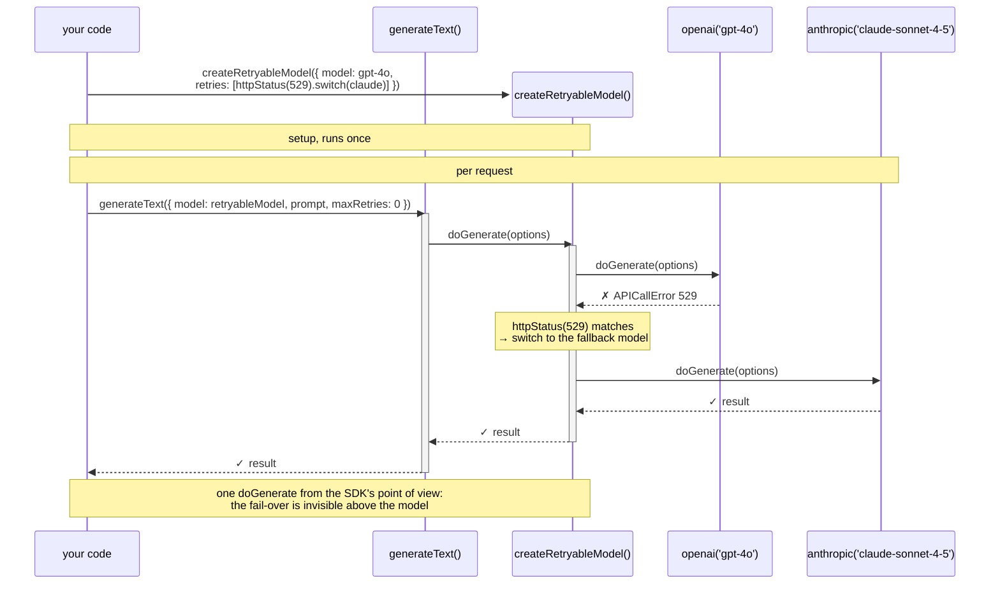
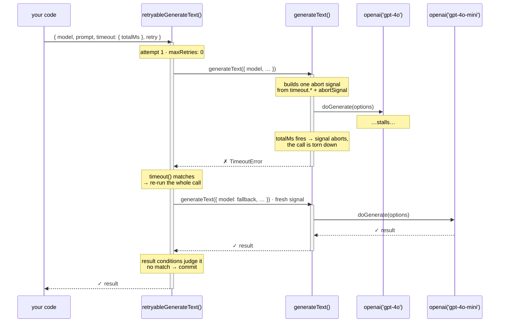

<div align='center'>

<picture>
  <source media="(prefers-color-scheme: dark)" srcset="assets/logo-dark.png" />
  <source media="(prefers-color-scheme: light)" srcset="assets/logo-light.png" />
  
</picture>

<p align="center">Retries and fallbacks for the AI SDK</p>
<p align="center">
  <a href="https://www.npmjs.com/package/ai-retry" alt="ai-retry"></a> <a href="https://github.com/zirkelc/ai-retry/actions/workflows/ci.yml" alt="CI"></a>
</p>

</div>

Automatically handle API failures, content filtering, timeouts and other errors by switching between different AI models and providers.

You declare a list of typed **conditions** (`httpStatus(529)`, `finishReason('content-filter')`, `timeout()`, …), each finalized with an action: `.retry()` the same model, or `.switch()` to a fallback. When a request fails, or succeeds with a result that is not good enough, the list is walked top-down until something matches. Attempts are tracked per model, so chains cannot loop.

Two shapes of failure are covered:

- **Error-based**: the model throws (timeouts, rate limits, API errors).
- **Result-based**: the response is successful but unusable (content filtering, schema mismatch, empty output).

## The two primitives

`ai-retry` offers the same retry system at two different points of the AI SDK call chain, and the position decides what a retry can recover.

### Retryable model

`createRetryableModel` wraps a model instance. The retry runs *inside* the models `doGenerate` / `doStream` / `doEmbed` methods. You build it once and hand it to any code that takes a `model`: `generateText`, `streamText`, `embed`, etc.



Because it sits below the call, it sees provider errors and raw results, but it is structurally blind to anything living *on* the call: a `timeout` argument or an inbound `abortSignal`. By the time one of those fires, the SDK has torn the call down and discards whatever a lower retry produced.

### Retryable call

`retryableGenerateText` (and its four siblings) wraps the actual function call. Each attempt is a fresh call (e.g. `generateText`) with its own abort signal, so call timeouts are recoverable too.



### Recovery matrix

| Failure                                | Visible at         | retryable model | retryable call                             |
| -------------------------------------- | ------------------ | --------------- | ------------------------------------------ |
| Provider error (e.g. 429, 529, 5xx)         | below the call     | recovers        | recovers                                   |
| Bad result (content filter, schema)    | both layers        | recovers        | recovers                                   |
| Timeout under `generateText`     | on the call        | recovers        | recovers                                   |
| Timeout under `streamText`       | on the call        | discarded       | recovers                                   |
| Inbound `abortSignal` fired            | on the call        | cannot see it   | honored, not retried; a cancel is deliberate |
| Error after the first content chunk    | after commit       | committed       | committed                                  |

A `timeout` argument belongs to the call, not to the model, which is why the two `streamText` rows differ. Full mechanics: [docs/timeouts.md](./docs/timeouts.md).

### Choosing a layer

- **Retryable model**: one configured model for code that only takes a `model` (an agent, a framework, a `Provider`). The retry configuration travels with the model.
- **Retryable call**: call timeouts and cancellation are recoverable, and the retry configuration sits next to the call.
- The layers [compose](./docs/timeouts.md#why-the-call-layer-recovers-what-a-retryable-model-cannot): a retryable model below handles provider fail-over, a retryable call above handles timeouts.

## Installation

> [!NOTE]
> Version compatibility:
>
> - Use [`ai-retry@0.x`](https://github.com/zirkelc/ai-retry/tree/v0.x) for AI SDK v5
> - Use [`ai-retry@1.x`](https://github.com/zirkelc/ai-retry/tree/v1.x) for AI SDK v6
> - Use `ai-retry@2.x` or `ai-retry@3.x` for AI SDK v7 (3.x drops the `experimental_` prefixes from the retryable functions, see the [migration guide](./MIGRATION.md))

```bash
npm install ai-retry@3
```

## Usage

### Retryable model

Create a retryable model with a base model and a list of conditions plus the action to take when a condition matches. Then pass it to any AI SDK function.

```typescript
import { anthropic } from '@ai-sdk/anthropic';
import { openai } from '@ai-sdk/openai';
import { generateText } from 'ai';
import {
  createRetryableModel,
  error,
  finishReason,
  httpStatus,
} from 'ai-retry/language-model';

const retryableModel = createRetryableModel({
  model: openai('gpt-4o'),
  retries: [
    // Fall back to a different model on HTTP 529 or any "overloaded" message
    httpStatus(529, 'overloaded').switch({
      model: anthropic('claude-sonnet-4-0'),
    }),

    // Fall back when the response was content-filtered
    finishReason('content-filter').switch({ model: openai('gpt-4o-mini') }),

    // Retry the same model with exponential backoff on retryable errors
    error.isRetryable(true).retry({ delay: 1_000, backoffFactor: 2 }),
  ],
});

const result = await generateText({
  model: retryableModel,
  prompt: 'Hello world!',
  // Let ai-retry own retries; see "Max retries" below
  maxRetries: 0,
});
```

Pick the entry point that matches the model family. Each module exposes `createRetryableModel` plus the conditions that make sense for that family, already typed for it.

| Entry point                | For models passed to                                           |
| -------------------------- | -------------------------------------------------------------- |
| `ai-retry/language-model`  | `generateText`, `streamText` |
| `ai-retry/embedding-model` | `embed`, `embedMany`                                           |
| `ai-retry/image-model`     | `generateImage`                                                |

```typescript
import { createRetryableModel, httpStatus } from 'ai-retry/embedding-model';
import { createRetryableModel, noImage } from 'ai-retry/image-model';
```

### Retryable call

Each retryable function takes exactly the arguments its AI SDK entry point takes, plus a `retry` field. The model stays a normal argument and is swapped per attempt.

| Function                 | Wraps           | Import from               |
| ------------------------ | --------------- | ------------------------- |
| `retryableGenerateText`  | `generateText`  | `ai-retry/generate-text`  |
| `retryableStreamText`    | `streamText`    | `ai-retry/stream-text`    |
| `retryableEmbed`         | `embed`         | `ai-retry/embed`          |
| `retryableEmbedMany`     | `embedMany`     | `ai-retry/embed-many`     |
| `retryableGenerateImage` | `generateImage` | `ai-retry/generate-image` |

#### `retryableGenerateText`

```typescript
import { anthropic } from '@ai-sdk/anthropic';
import { openai } from '@ai-sdk/openai';
import { retryableGenerateText } from 'ai-retry/generate-text';
import { finishReason, httpStatus } from 'ai-retry/generate-text/conditions';

const result = await retryableGenerateText({
  model: anthropic('claude-sonnet-4-5'),
  prompt: 'Invent a new holiday.',
  /** A whole-call deadline, recoverable here because the retry re-issues the call. */
  timeout: { totalMs: 20_000 },
  retry: [
    /** Overloaded upstream: same prompt, different provider. */
    httpStatus(529).switch({ model: openai('gpt-4o') }),
    /** A refusal is a successful response, so only a result condition sees it. */
    finishReason('content-filter').switch({ model: openai('gpt-4o-mini') }),
  ],
});
```

#### `retryableStreamText`

> [!IMPORTANT]
> `retryableStreamText` returns a **promise** where `streamText` returns its result synchronously.

```typescript
import { openai } from '@ai-sdk/openai';
import { retryableStreamText } from 'ai-retry/stream-text';
import { timeout } from 'ai-retry/stream-text/conditions';

/** Note the `await`: unlike `streamText`, this resolves once an attempt commits. */
const result = await retryableStreamText({
  model: openai('gpt-4o'),
  prompt: 'Invent a new holiday.',
  /** No model-level retry could recover this one. */
  timeout: { firstChunkMs: 2_000 },
  retry: [timeout().switch({ model: openai('gpt-4o-mini') })],
});

for await (const chunk of result.textStream) process.stdout.write(chunk);
```

#### `retryableEmbed`

> [!IMPORTANT]
> By default, `embed` has no `timeout` argument, only `abortSignal`. `retryableEmbed` adds a `timeout` property and turns this into a fresh `AbortSignal` per attempt.

```typescript
import { openai } from '@ai-sdk/openai';
import { azure } from '@ai-sdk/azure';
import { retryableEmbed } from 'ai-retry/embed';
import { httpStatus } from 'ai-retry/embed/conditions';

const result = await retryableEmbed({
  model: openai.textEmbedding('text-embedding-3-small'),
  value: 'sunny day at the beach',
  /** Not an `embed` argument. Each attempt gets its own 5s. */
  timeout: 5_000,
  retry: [
    /** Rate limited: wait it out on the same model before moving on. */
    httpStatus(429).retry({ maxAttempts: 3, delay: 1_000, backoffFactor: 2 }),
    /** Still failing, so switch. A bare model is shorthand for "always try this next". */
    azure.textEmbedding('text-embedding-3-large'),
  ],
});

console.log(result.embedding.length);
```

#### `retryableEmbedMany`

```typescript
import { openai } from '@ai-sdk/openai';
import { azure } from '@ai-sdk/azure';
import { retryableEmbedMany } from 'ai-retry/embed-many';
import { httpStatus } from 'ai-retry/embed-many/conditions';

const { embeddings } = await retryableEmbedMany({
  model: openai.textEmbedding('text-embedding-3-small'),
  values: ['sunny day at the beach', 'rainy afternoon in the city'],
  retry: [
    /** Rate limited: wait it out on the same model before moving on. */
    httpStatus(429).retry({ maxAttempts: 3, delay: 1_000, backoffFactor: 2 }),
    /** Still failing, so switch. A bare model is shorthand for "always try this next". */
    azure.textEmbedding('text-embedding-3-large'),
  ],
});
```

#### `retryableGenerateImage`

```typescript
import { openai } from '@ai-sdk/openai';
import { retryableGenerateImage } from 'ai-retry/generate-image';
import { noImage, result } from 'ai-retry/generate-image/conditions';

const { images } = await retryableGenerateImage({
  model: openai.image('dall-e-3'),
  prompt: 'a cat wearing a hat',
  n: 2,
  retry: [
    /** Returned no image at all. */
    noImage().switch({ model: openai.image('gpt-image-1') }),
    /** Returned fewer than asked for. */
    result((res) => res.images.length < 2).switch({
      model: openai.image('gpt-image-1'),
    }),
  ],
});
```

## Retries

The list of things `ai-retry` tries, in order, is the `retries` option on a retryable model, and the `retry` argument on a retryable function (whose object form names the inner list `retries` as well). Its entries are of two kinds:

- **Fallbacks** are model instances (or gateway strings). They always match and are used as plain fallbacks.
- **Conditions** are typed predicates produced by helpers like `error()` or `httpStatus()` and finalized with a `.switch()` or `.retry()` action. They only fire when their predicate matches.

You can think of the array as a big `if-else` chain: each condition is an `if` branch matching some error or result, and each fallback is an `else` branch matching anything left over. Order matters: the array is evaluated top-down until one matches. Once everything is exhausted, a `RetryError` is thrown (see [Error handling](#error-handling)).

```typescript
const retryableModel = createRetryableModel({
  model: openai('gpt-4'),
  retries: [
    // Condition: match HTTP 429 (rate limit)
    httpStatus(429).switch({ model: azure('gpt-4-mini') }),

    // Fallback: switch to Anthropic for anything else
    anthropic('claude-3-haiku-20240307'),
    // Same as: { model: anthropic('claude-3-haiku-20240307'), maxAttempts: 1 }
  ],
});
```

### Fallbacks

A fallback is a plain model instance (or gateway string). It always matches, so it acts as a catch-all: when no earlier condition fired, the next fallback is tried. Each fallback is attempted once by default; use the object form to pass [Retry fields](#retry-fields) like `maxAttempts`, `delay` or `timeout`.

```typescript
const retryableModel = createRetryableModel({
  model: openai('gpt-4o'),
  retries: [
    openai('gpt-4o-mini'), // first fallback
    anthropic('claude-3-haiku-20240307'), // second fallback

    // Object form to pass options:
    { model: anthropic('claude-3-haiku-20240307'), maxAttempts: 2 },
  ],
});
```

### Conditions

A condition is a typed predicate over the retry context, produced by helpers like `httpStatus()`, `finishReason()` or the low-level `error()` / `result()`. Conditions are typed for their layer and model family, and do nothing on their own: an action turns one into a retryable. Every helper is documented in the [Condition reference](#condition-reference).

### Actions

Every condition exposes two terminal actions that turn it into a retryable:

- **`.switch({ model, ...options })`** falls back to a different model when the condition matches. Optional fields (`maxAttempts`, `delay`, `backoffFactor`, `timeout`, `options`) are the same as on a normal `Retry` object. `maxAttempts` defaults to `1`.
- **`.retry({ delay?, backoffFactor?, maxAttempts?, ... })`** retries the **current** model when the condition matches. Honors `Retry-After` and `Retry-After-Ms` response headers, capped at 60 seconds. `maxAttempts` defaults to `2` (one original attempt + one retry); values below `2` throw, since the retry budget is consumed by the original failure.

```typescript
// Switch on a timeout, with a fresh timeout for the fallback
timeout().switch({ model: fallback, timeout: 30_000 });

// Retry the current model with exponential backoff, max 3 attempts
error.isRetryable(true).retry({ delay: 1_000, backoffFactor: 2, maxAttempts: 3 });
```

### Retry fields

Every entry in the list, whether a bare fallback model, a `.switch()` target or a `.retry()`, is described by the same `Retry` object:

| Field           | Description                                                                                                    |
| --------------- | -------------------------------------------------------------------------------------------------------------- |
| `model`         | Model for the next attempt                                                                                      |
| `maxAttempts`   | Attempts allowed per unique model (`provider/modelId`). Defaults: `1` for fallbacks and `.switch()`, `2` for `.retry()` |
| `delay`         | Milliseconds to wait before the attempt                                                                         |
| `backoffFactor` | Multiplier applied to `delay` on every further attempt                                                          |
| `timeout`       | Fresh deadline for the attempt. Accepted shape depends on the layer (see [Model layer](#model-layer) and [Call layer](#call-layer)) |
| `options`       | Argument overrides for the attempt. Shape depends on the layer                                                  |

- Attempts are counted per unique model, so the same model listed in several retryables shares one budget.
- Delays respect the request's abort signal, so a waiting retry can still be cancelled.

```typescript
const retryableModel = createRetryableModel({
  model: openai('gpt-4'),
  retries: [
    // Exponential backoff: 2s, 4s, 8s
    { model: openai('gpt-4'), delay: 2_000, backoffFactor: 2, maxAttempts: 3 },
  ],
});
```

### Disabling

`disabled` turns all retry logic off: as an option on `createRetryableModel`, or inside a retryable function's `retry` object. It accepts a boolean or a function. When disabled, the base model or call executes directly.

```typescript
const retryableModel = createRetryableModel({
  model: openai('gpt-4'),
  retries: [/* ... */],
  disabled: true, // hard off
  // disabled: process.env.NODE_ENV === 'test',      // env-based
  // disabled: () => !featureFlags.isEnabled('ai'),  // dynamic
});
```

### Callbacks

Both layers accept the same two per-attempt callbacks:

- `onError` fires for every failed attempt, recovered or not.
- `onRetry` fires before the next attempt; `context.current.model` is the model about to be tried. It may return argument overrides for that attempt, useful when they depend on the failed attempt.

Override precedence, highest first: the `onRetry` return value, then `Retry.options`, then the original arguments.

```typescript
const retryableModel = createRetryableModel({
  model: azure('gpt-5-chat'),
  retries: [openai('gpt-5-chat')],
  onRetry: (context) => {
    const { current, attempts } = context;
    if (current.model.provider !== attempts.at(-1).model.provider) {
      /** Strip provider-scoped metadata before retrying on a different provider. */
      return { options: { prompt: stripProviderMetadata(current.options.prompt) } };
    }
  },
});
```

Each layer adds its own terminal callbacks, documented in its section below.

## Condition reference

The condition helpers are shared between both layers. At the model layer, import them from the model entry point (`ai-retry/language-model`, …); at the call layer, from `ai-retry/<function>/conditions`. Each import is typed for its destination, and the type system keeps the layers apart: a model-level condition in a call-level `retry` is a type error, and the reverse too.

### Universal conditions

Available everywhere.

| Helper                          | Kind       | Matches when                                                                    |
| ------------------------------- | ---------- | ------------------------------------------------------------------------------- |
| `error(predicate)`              | low-level  | The current attempt failed and `predicate(err, ctx)` returns true               |
| `error.isInstance(cls)`         | low-level  | The error is an instance of `cls` (prefers `cls.isInstance`, else `instanceof`) |
| `error.isRetryable(flag)`       | low-level  | `APICallError.isRetryable === flag` (default `true`)                            |
| `error.statusCode(...patterns)` | low-level  | Numbers match the status code exactly; regex matches the stringified code       |
| `error.message(...patterns)`    | low-level  | Substring (case-insensitive) or regex match against the error message           |
| `error.isTimeout()`             | low-level  | `Error.name === 'TimeoutError'` (`AbortSignal.timeout()` fired)                 |
| `error.isAbort()`               | low-level  | `Error.name === 'AbortError'` (manual `controller.abort()`)                     |
| `httpStatus(...patterns)`       | high-level | Numbers match the status code; strings match the message; regex matches either  |
| `timeout()`                     | high-level | Alias for `error.isTimeout()`                                                   |
| `aborted()`                     | high-level | Alias for `error.isAbort()`                                                     |

#### `error(predicate)`

Takes any predicate over the failed attempt's error. Its namespace bundles the common matchers: `isInstance` (matches an error class), `isRetryable` (defaults to `true`), `statusCode` (numbers or regex), `message` (case-insensitive substring or regex), and `isTimeout` / `isAbort` (match `AbortSignal.timeout()` firing vs a manual `controller.abort()`). The pattern matchers accept any number of patterns and match if any matches.

```typescript
error((e) => APICallError.isInstance(e) && e.statusCode === 418).switch({
  model: fallback,
});

error.isInstance(APICallError).switch({ model: fallback }); // AI SDK marker check
error.isInstance(TypeError).switch({ model: fallback }); // plain instanceof

error.isRetryable().switch({ model: fallback }); // defaults to true
error.isRetryable(false).switch({ model: fallback });

error.statusCode(503, 529).switch({ model: fallback });
error.statusCode(/^5\d\d$/).switch({ model: fallback }); // any 5xx

error.message('overloaded').switch({ model: fallback }); // substring
error.message(/rate.?limit/i).switch({ model: fallback }); // regex

error.isTimeout().switch({ model: fallback }); // AbortSignal.timeout() fired
error.isAbort().switch({ model: fallback }); // manual controller.abort()
```

#### `httpStatus(...patterns)`

Matches an `APICallError` by status code (numbers), message substring (strings), or either (regex). Mix any combination in one call.

```typescript
httpStatus(429).switch({ model: fallback }); // status code
httpStatus(529, 'overloaded').switch({ model: fallback }); // status or message
httpStatus(/^5\d\d$/).switch({ model: fallback }); // any 5xx
```

#### `timeout()`

Alias for `error.isTimeout()`: matches `AbortSignal.timeout()` firing (`Error.name === 'TimeoutError'`); pass a fresh `timeout` to the action so the fallback gets its own deadline.

```typescript
timeout().switch({ model: fallback, timeout: 30_000 });
```

#### `aborted()`

Alias for `error.isAbort()`: matches a manual `controller.abort()` (`Error.name === 'AbortError'`).

```typescript
aborted().switch({ model: fallback });
```

Each high-level helper is a thin wrapper around the low-level ones. `httpStatus(...)` composes `error.statusCode(...)` with `error.message(...)`, and `timeout()` / `aborted()` are aliases for `error.isTimeout()` / `error.isAbort()`.

### Result conditions

Result-based conditions inspect a successful response.

| Helper                     | Available at                            | Matches when                                                          |
| -------------------------- | --------------------------------------- | --------------------------------------------------------------------- |
| `result(predicate)`        | language models, every call-level entry | The attempt succeeded and `predicate(res, ctx)` returns true          |
| `finishReason(...reasons)` | language models, text calls             | The result's finish reason matches one of the given values            |
| `schemaInvalid()`          | language models only                    | The result text fails JSON-schema validation against `responseFormat` |
| `noImage()`                | image models, `generateImage` calls     | The model threw `NoImageGeneratedError`                               |

#### `result(predicate)`

Takes any predicate over the successful result. What it receives differs by layer:

- At the **model layer**, the provider-level result. Language models only; the embedding and image wrappers have no result branch.
- At the **call layer**, the entry point's **own** result, the object you would have got back. There is one result type per entry point, so every field reads directly. An embedding call can fail over on a degenerate embedding, and an image call on too few images, neither of which is an error.

```typescript
import { result } from 'ai-retry/generate-text/conditions';

result((res) => {
  if (res.finishReason === 'content-filter') return true;
  if (res.usage.outputTokens === 0) return true;
  return res.text.length < 10;
}).switch({ model: fallbackModel });
```

| import from                          | `result()` receives                                    |
| ------------------------------------ | ------------------------------------------------------ |
| `ai-retry/generate-text/conditions`  | the completed `generateText` result                    |
| `ai-retry/stream-text/conditions`    | `finishReason`, `usage`, `providerMetadata`, see below |
| `ai-retry/embed/conditions`          | the completed `embed` result (`embedding`)             |
| `ai-retry/embed-many/conditions`     | the completed `embedMany` result (`embeddings`)        |
| `ai-retry/generate-image/conditions` | the completed `generateImage` result                   |

`streamText` is the exception: a pre-commit stream has emitted no text and no tool calls by definition, so its `result()` sees only `finishReason`, `usage` and `providerMetadata` (`StreamTextCommitResult`). A `result()` written for `generate-text` (which reads `res.text`) is a type error in a `stream-text` retry.

To type tool calls against a specific tool set, name it at the condition: `result<typeof tools>(...)`. There is no call site to infer it from, since a condition is written against the entry point rather than against one call.

```typescript
result<typeof tools>((res) => {
  const call = res.toolCalls[0];
  return call !== undefined && !call.dynamic && call.toolName === 'lookup';
}).retry({ maxAttempts: 3 });
```

#### `finishReason(...reasons)`

Matches the result's unified finish reason against one or more values.

```typescript
finishReason('content-filter').switch({ model: fallback });
finishReason('length', 'content-filter').retry({ maxAttempts: 3 });
```

#### `schemaInvalid()`

Matches when the result text fails JSON-schema validation against the call's `responseFormat` (set automatically by `Output.object()`). Model layer only: it reads `responseFormat` off the provider call options, which do not exist around a call.

```typescript
schemaInvalid().switch({ model: fallback });
```

#### `noImage()`

Matches when the image model threw `NoImageGeneratedError`.

```typescript
noImage().switch({ model: fallback });
```

### Combinators

Compose conditions with `or()`, `and()`, `not()`. They infer the model family and layer from their arguments; `or()` and `and()` are variadic.

```typescript
or(httpStatus(429), error.message('overloaded')).switch({ model: fallback });
and(httpStatus(503), error.message('temporary')).switch({ model: fallback });
not(error.isRetryable(true)).switch({ model: fallback });
```

### Custom predicates

When the helpers don't cover the field you need, drop down to `error(predicate)` / `result(predicate)`. The predicate receives `(err | result, ctx)` and can be `async`; `ctx` is fully typed for the entry point you imported from, so the current attempt, the model, and all previous attempts are available.

```typescript
/** OpenAI-style error code nested at data.error.code. `e` is `unknown`. */
const isContentFilter = (e: unknown) => {
  if (!APICallError.isInstance(e)) return false;
  const data = e.data as { error?: { code?: string } } | undefined;
  return data?.error?.code === 'content_filter';
};

error(isContentFilter).switch({ model: anthropic('claude-3-haiku-20240307') });
```

A check like "only retry on the first attempt" is just `(e, ctx) => ctx.attempts.length === 1 && isContentFilter(e)`.

## Model layer

Options specific to `createRetryableModel`.

### Option overrides

A retry can replace any of the provider call options for its attempt: the prompt, sampling settings, headers, or `providerOptions`. Overrides completely replace the original values; anything not named falls through to the request's own.

```typescript
const retryableModel = createRetryableModel({
  model: openai('gpt-5'),
  retries: [
    {
      model: openai('gpt-4o'),
      options: {
        temperature: 0.3,
        maxOutputTokens: 500,
        providerOptions: { openai: { user: 'fallback-user' } },
      },
    },
  ],
});
```

The overridable fields per model family:

| Language model option | Description                                    |
| --------------------- | ---------------------------------------------- |
| `prompt`              | Override the entire prompt for the retry       |
| `temperature`         | Temperature setting for controlling randomness |
| `topP`                | Nucleus sampling parameter                     |
| `topK`                | Top-K sampling parameter                       |
| `maxOutputTokens`     | Maximum number of tokens to generate           |
| `seed`                | Random seed for deterministic generation       |
| `stopSequences`       | Stop sequences to end generation               |
| `presencePenalty`     | Presence penalty for reducing repetition       |
| `frequencyPenalty`    | Frequency penalty for reducing repetition      |
| `headers`             | Additional HTTP headers                        |
| `providerOptions`     | Provider-specific options                      |

| Embedding model option | Description                  |
| ---------------------- | ---------------------------- |
| `values`               | Override the values to embed |
| `headers`              | Additional HTTP headers      |
| `providerOptions`      | Provider-specific options    |

| Image model option | Description                      |
| ------------------ | -------------------------------- |
| `n`                | Number of images to generate     |
| `size`             | Size of generated images         |
| `aspectRatio`      | Aspect ratio of generated images |
| `seed`             | Random seed for reproducibility  |
| `headers`          | Additional HTTP headers          |
| `providerOptions`  | Provider-specific options        |

### Timeouts

When a retry specifies a `timeout` (a number of milliseconds), a fresh `AbortSignal.timeout()` is created for that attempt and composed with the original signal, so user cancellation still works. If the original signal has already fired, setting `timeout` is the explicit opt-in for retrying past it; without one, `ai-retry` re-throws rather than firing a doomed retry. See [docs/timeouts.md](./docs/timeouts.md) for the full mechanics.

```typescript
const retryableModel = createRetryableModel({
  model: openai('gpt-4'),
  retries: [timeout().switch({ model: openai('gpt-3.5-turbo'), timeout: 30_000 })],
});
```

### Outcome callbacks

- `onSuccess` fires after a successful request, with the model that handled it.
- `onFailure` fires when the request ultimately fails and no retry recovered it. `context.error` is the error surfaced to the caller.
- Exactly one of the two fires per request. Neither fires when retries are disabled.

### Reset

By default, every new request starts with the base model. The `reset` option makes the last successfully retried model **sticky**: subsequent requests continue using it until the reset condition fires.

| Value              | Description                                                  |
| ------------------ | ------------------------------------------------------------ |
| `after-request`    | Reset immediately after the next request (default)           |
| `after-N-requests` | Keep the retry model for the next **N** requests, then reset |
| `after-N-seconds`  | Keep the retry model for **N** seconds, then reset           |

```typescript
const retryableModel = createRetryableModel({
  model: openai('gpt-4o-mini'),
  retries: [anthropic('claude-sonnet-4-20250514')],
  reset: 'after-5-requests',
});
```

## Call layer

Options specific to the retryable functions.

### The retry argument

A bare array is the common form of `retry`; pass an object for hooks, telemetry or the disable switch:

```typescript
const result = await retryableGenerateText({
  model: primaryModel,
  prompt: 'Invent a new holiday.',
  retry: {
    retries: [httpStatus(529).switch({ model: fallbackModel })],
    onRetry: (context) => console.log(`Retrying with ${context.current.model.modelId}`),
    onSettled: (event) => console.log(`${event.outcome} after ${event.attempts.length} attempt(s)`),
    telemetry: { isEnabled: true },
  },
});
```

Everything sits under one key, so the SDK can add arguments of its own without colliding with this library's.

### Argument overrides

`Retry.options` holds the entry point's **own** arguments, so a retry can rewrite the prompt in the shape you wrote it. Overrides are checked against the entry point they are handed to: `options: { values }` belongs to `embedMany` and is rejected by `retryableEmbed`.

```typescript
retry: [{ model: fallbackModel, options: { prompt: 'Answer in one sentence.' } }],
```

### Timeouts

`Retry.timeout` gives each attempt a fresh deadline. A number is a total budget in milliseconds; an object is the SDK's own timeout configuration, **merged** into whatever the call already carried, key by key. Which shape a retry accepts depends on the retryable function. `embed`, `embedMany` and `generateImage` additionally take a call-level `timeout` argument the SDK does not give them, turned into a fresh `AbortSignal` per attempt. Details and tables: [docs/timeouts.md](./docs/timeouts.md#retry-timeouts-at-the-call-layer).

```typescript
const result = await retryableStreamText({
  model: primaryModel,
  prompt: 'Invent a new holiday.',
  timeout: { totalMs: 30_000, firstChunkMs: 5_000 },
  retry: [
    /** This attempt gets firstChunkMs 2s, and keeps totalMs 30s. */
    timeout().switch({ model: fallbackModel, timeout: { firstChunkMs: 2_000 } }),
  ],
});
```

### Outcome callbacks

`onSettled` is the terminal hook: called exactly once per call with its final outcome.

```typescript
const result = await retryableGenerateText({
  model: primaryModel,
  prompt: 'Invent a new holiday.',
  retry: {
    retries: [fallbackModel],
    onSettled: ({ outcome, attempts }) =>
      metrics.increment(
        `ai_retry.${outcome}.${attempts.length > 1 ? 'retried' : 'first_try'}`,
      ),
  },
});
```

`attempts` always holds **every** attempt, the terminal one included, so `outcome` and `attempts.length` distinguish the four cases:

|                         | `outcome` | `attempts.length` |
| ----------------------- | --------- | ----------------- |
| succeeded, no retry     | `success` | 1                 |
| succeeded after a retry | `success` | > 1               |
| failed, no retry        | `failure` | 1                 |
| failed after retrying   | `failure` | > 1               |

The event also carries `model` (the one that settled it, or the one whose failure ended the loop), `result` on success and `error` on failure. Each entry in `attempts` says how it ended: `error`, `result` (judged, then retried) or `success`.

- For `streamText` it settles at the **commit point**, the first content part, not at the end of the stream. A stream you never consume still settles; for end-to-end stream health, use `streamText`'s own `onFinish` and `onError` on the same call.
- It stays silent when retries are `disabled`, and when the rejection came from no attempt at all (one of your own callbacks throwing).

**It mirrors the operation span**, so a metric built on the hook and one built on [telemetry](#telemetry) agree by construction:

| span attribute         | `onSettled`       |
| ---------------------- | ----------------- |
| `ai_retry.outcome`     | `outcome`         |
| `ai_retry.attempts`    | `attempts.length` |
| `ai_retry.model.final` | `model`           |
| `ai_retry.error`       | `error`           |

### Stream callbacks

`retryableStreamText` issues every attempt with the arguments you passed, callbacks included. To keep discarded attempts invisible:

- `onFinish`, `onAbort`, `onStepFinish`, `onChunk` and `onError` are held back until the loop knows which attempt is the one you get.
- A discarded attempt is silent. The attempt you receive reports exactly once, always after `onSettled`.
- Errors that a retry recovered from reach the retry's own `onError`, not the call's.
- Nothing is delayed on the happy path: a committed stream's callbacks are driven by you reading it, which happens after the loop has settled.

```typescript
await retryableStreamText({
  model: primaryModel,
  prompt: 'Invent a new holiday.',
  /** The call you received. Silent for attempts that were discarded. */
  onError: (event) => log.error(event.error),
  retry: {
    retries: [fallbackModel],
    /** Every failed attempt, recovered or not. */
    onError: (context) => log.warn(context.current.error),
  },
});
```

## Streaming

- Fail-over stops at the **first content chunk**. After it, the response is committed to the current model and errors propagate to the stream instead of triggering a fallback. The boundary applies at both layers.
- Before commit, an error, a timeout, or a finish with no content at all can fail over.
- Result conditions on streams are judged when the `finish` part arrives, and only when no content has been emitted.
- The non-streaming functions have no commit boundary: an attempt is recoverable until it resolves, for errors and result conditions alike.
- After a fail-over, the consumer sees exactly one stream preamble, the one belonging to the model that produced the output. The "stream started" signal arrives at first-content time rather than when the response headers arrive.
- If reliable retries are critical, prefer `generateText` over `streamText`.

## Error handling

If all retry attempts fail, a `RetryError` is thrown containing all individual errors. If no retry was attempted (no retryable matched), the original error is re-thrown directly.

```typescript
import { RetryError } from 'ai';

try {
  const result = await generateText({ model: retryableModel, prompt: 'Hello!' });
} catch (err) {
  if (err instanceof RetryError) {
    console.error('All retry attempts failed:', err.errors);
  }
}
```

## Max retries

The AI SDK functions wrap **every** model in their own retry loop, controlled by `maxRetries`, which defaults to `2`. Since `ai-retry` also implements its own retry logic, the two layers can interact, potentially causing more retries than expected if both are active. It's recommended to set `maxRetries: 0` on the AI SDK functions when using `ai-retry` to avoid overlapping retry loops.

## Vercel AI Gateway

You can pass a model as a string and it will be resolved through the default `gateway` [provider instance](https://ai-sdk.dev/providers/ai-sdk-providers/ai-gateway#provider-instance). Each entry point resolves strings to its own model family, so the string is typed against that family's gateway model ids.

```typescript
const retryableModel = createRetryableModel({
  model: 'openai/gpt-5',
  retries: ['anthropic/claude-sonnet-4'],
});
```

## Telemetry

`ai-retry` can emit [OpenTelemetry](https://opentelemetry.io/) spans for each request and every retry attempt. Spans are created on the active OpenTelemetry context, so they nest automatically under the AI SDK's own spans when that integration is active. A single trace then shows the individual attempts: which model each used, why it was retried, and the backoff between them.

Telemetry uses the optional peer dependency `@opentelemetry/api`. Install [`@ai-sdk/otel`](https://ai-sdk.dev/docs/ai-sdk-core/telemetry) or `@opentelemetry/api` directly, register an OpenTelemetry SDK once at startup, then opt in per model or per call:

```typescript
const retryableModel = createRetryableModel({
  model: openai('gpt-4o'),
  retries: [anthropic('claude-sonnet-4-5')],
  telemetry: { isEnabled: true },
});
```

```ts
interface RetryTelemetrySettings {
  isEnabled?: boolean;
  tracer?: Tracer; // defaults to trace.getTracer('ai-retry')
  metadata?: Record<string, AttributeValue>;
}
```

Spans are emitted only when `isEnabled` is `true`. By default the global tracer is used, which is a no-op until an OpenTelemetry SDK is registered. Prompts and generated content are **not** recorded, only metadata (models, outcomes, errors, timing).

Each request creates one operation span (`ai_retry.doGenerate`, `ai_retry.doStream`, `ai_retry.doEmbed`, or the entry point name at the call layer) with one child `ai_retry.attempt` span per attempt:

```
ai_retry.doGenerate            outcome=success, attempts=2
├─ ai_retry.attempt #1         outcome=retry,   type=error   (529 → fallback)
└─ ai_retry.attempt #2         outcome=success, type=result
```

**Operation span** attributes:

| Attribute                                                                    | Description                                                                  |
| ---------------------------------------------------------------------------- | ---------------------------------------------------------------------------- |
| `ai_retry.operation`                                                         | the wrapped operation                                                        |
| `ai_retry.outcome`                                                           | `success` or `failure`                                                       |
| `ai_retry.attempts`                                                          | total number of attempts                                                     |
| `ai_retry.model.start`                                                       | the model the request started with (`provider/modelId`)                      |
| `ai_retry.model.final`                                                       | the model that produced the final outcome                                    |
| `ai_retry.error.{name,message,status,cause.name,cause.message,cause.status}` | the failing error (on failure); `status` when it carries an HTTP status code |
| `ai_retry.metadata.*`                                                        | from the telemetry settings `metadata`                                       |

**Attempt span** (`ai_retry.attempt`) attributes:

| Attribute                                                                            | Description                                                              |
| ------------------------------------------------------------------------------------ | ------------------------------------------------------------------------ |
| `ai_retry.attempt.number`                                                            | 1-based attempt index                                                    |
| `ai_retry.attempt.model`                                                             | model used (`provider/modelId`)                                          |
| `ai_retry.attempt.outcome`                                                           | `success`, `retry`, or `failure`                                         |
| `ai_retry.attempt.type`                                                              | `result` or `error`                                                      |
| `ai_retry.attempt.finish_reason`                                                     | finish reason (result attempts)                                          |
| `ai_retry.attempt.delay_ms`                                                          | backoff scheduled before the next attempt                                |
| `ai_retry.attempt.timeout_ms`                                                        | timeout budget, when the retry set one                                   |
| `ai_retry.attempt.error.{name,message,status,cause.name,cause.message,cause.status}` | the error (error attempts); `status` when it carries an HTTP status code |

Attempt spans also carry the standard `gen_ai.request.model` / `gen_ai.provider.name` attributes so observability tools (Langfuse, etc.) recognize and render them. The attempt span is also the **active** span while its call runs, so the AI SDK's own spans, and the provider's beneath them, nest inside the attempt that issued them. Retries on streams only happen before the first content chunk, so a `doStream` attempt is marked `success` once content begins flowing.

See [`examples/telemetry`](./examples/telemetry) for a runnable example that exports to Langfuse.

## API Reference

### `createRetryableModel(options)`

Imported from the per-model entry point (`ai-retry/language-model`, `ai-retry/embedding-model`, `ai-retry/image-model`). Each entry returns a model already narrowed to that family.

```ts
interface RetryableModelOptions<MODEL extends LanguageModel | EmbeddingModel | ImageModel> {
  model: MODEL; // base model instance, or a gateway model-id string
  retries: Array<ModelRetryable<MODEL> | MODEL>;
  disabled?: boolean | (() => boolean); // default false
  reset?: Reset; // default 'after-request'
  telemetry?: RetryTelemetrySettings;
  onError?: (context: ModelRetryContext<MODEL>) => void;
  onRetry?: (
    context: ModelRetryContext<MODEL>,
  ) => void | OnRetryOverrides<MODEL> | Promise<void | OnRetryOverrides<MODEL>>;
  onSuccess?: (context: ModelSuccessContext<MODEL>) => void;
  onFailure?: (context: ModelFailureContext<MODEL>) => void;
}
```

### `retryableGenerateText(args)` and siblings

Each retryable function takes its SDK entry point's arguments plus `retry`, either a bare array of retryables or an options object:

```ts
interface CallRetryOptions<MODEL> {
  retries: Array<CallRetryable<MODEL> | MODEL>;
  disabled?: boolean | (() => boolean);
  telemetry?: RetryTelemetrySettings;
  onError?: (context: CallRetryContext<MODEL>) => void;
  onRetry?: (
    context: CallRetryContext<MODEL>,
  ) => void | OnRetryOverrides<MODEL> | Promise<void | OnRetryOverrides<MODEL>>;
  onSettled?: (event: CallSettledEvent<MODEL>) => void;
}
```

### `Retry`

The shape returned by a retryable (and accepted in static `retries` entries) describing the next attempt.

```ts
interface Retry<MODEL> {
  model: MODEL;
  maxAttempts?: number; // default: 1 for switch, 2 for retry
  delay?: number; // ms before the attempt
  backoffFactor?: number; // exponential multiplier
  timeout?: RetryTimeout; // fresh deadline for this attempt
  options?: ModelRetryCallOptions<MODEL>; // call layer: the entry point arguments instead
}
```

### Retryables and contexts

A retryable is a function that receives a retry context and returns a `Retry` (to fire) or `undefined` (to skip). The `.switch()` and `.retry()` actions build them for you; hand-written retryables are still supported.

```ts
type ModelRetryable<MODEL> = (
  context: ModelRetryContext<MODEL>,
) => Retry<MODEL> | Promise<Retry<MODEL> | undefined> | undefined;

interface ModelRetryContext<MODEL> {
  current: ModelRetryAttempt<MODEL>; // the failed or judged attempt
  attempts: Array<ModelRetryAttempt<MODEL>>; // everything so far
}

type ModelRetryAttempt<MODEL> =
  | { type: 'error'; error: unknown; model: MODEL; options: ModelCallOptions<MODEL> }
  | {
      type: 'result';
      result: LanguageModelResult;
      finishReason: ModelFinishReason; // lifted out of the provider's nested shape
      model: LanguageModel;
      options: LanguageModelCallOptions;
    };
```

Result attempts only fire for language models; the embedding and image wrappers have no result branch. `isErrorAttempt` and `isResultAttempt` type guards are exported from the package root.

### Naming: `Model*` and `Call*`

Types belonging to one retry layer carry its prefix, so the two never read alike:

| model layer (`createRetryableModel`)  | call layer (the retry functions)  |
| ------------------------------------- | --------------------------------- |
| `ModelRetryContext`                   | `CallRetryContext`                |
| `ModelRetryAttempt`                   | `CallRetryAttempt`                |
| `ModelRetryable` / `ModelRetries`     | `CallRetryable` / `CallRetries`   |
| `ModelSuccessContext` / `ModelFailureContext` | `CallSettledEvent` (`onSettled`) |
| `ModelCallOptions` (provider options) | `CallArgs` (entry point args)     |
| `ModelResult` (provider result)       | `*CommitResult` (per entry point) |

`Retry`, `OnRetryOverrides`, `Reset` and `RetryTelemetrySettings` are genuinely shared and carry no prefix. `Condition<MODEL, LAYER, COMMIT>` underlies both layers; `LAYER` decides which context the predicate sees and which retryable comes out.

## Migration

- **v2 → v3**: the retryable functions lost their `experimental_` prefix. Import `retryableGenerateText` instead of `experimental_retryableGenerateText`, and so on for all five.
- The deprecated function-style retryables (`contentFilterTriggered`, `serviceOverloaded`, …) and the root `createRetryable` are documented in the [v1 README](https://github.com/zirkelc/ai-retry/blob/v1.x/README.md); see the [migration guide](./MIGRATION.md) to convert to the condition API.

## License

MIT
