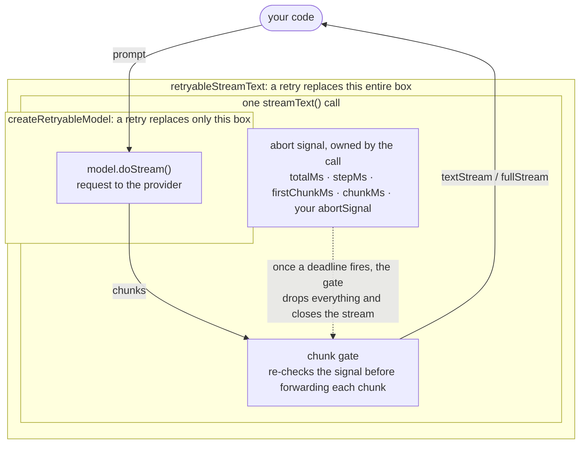
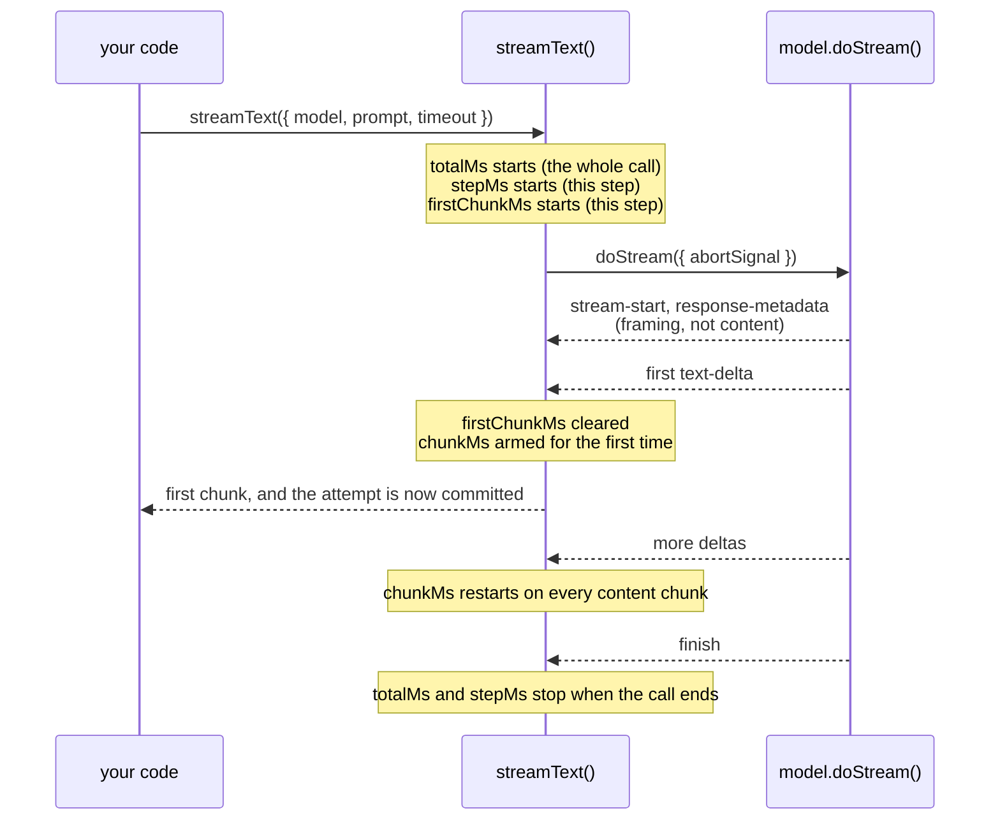

<div align='center'>

<picture>
  <source media="(prefers-color-scheme: dark)" srcset="assets/logo-dark.png" />
  <source media="(prefers-color-scheme: light)" srcset="assets/logo-light.png" />
  
</picture>

<p align="center">Retries and fallbacks for the AI SDK</p>
<p align="center">
  <a href="https://www.npmjs.com/package/ai-retry" alt="ai-retry"></a> <a href="https://github.com/zirkelc/ai-retry/actions/workflows/ci.yml" alt="CI"></a>
</p>

</div>

Automatically handle API failures, content filtering, timeouts and other errors by switching between different AI models and providers.

`ai-retry` wraps a base model with a list of typed retry **conditions**. When a request fails with an error, or the response is not satisfying, it walks the conditions top-down to find a suitable fallback. It tracks which models have been tried and how many attempts have been made to prevent infinite loops.

Two retry shapes are supported:

- **Error-based**: the model throws (timeouts, rate limits, API errors).
- **Result-based**: the model returns a successful response that still needs retrying (content filtering, schema mismatch, etc.).

### Installation

> [!NOTE]
> Version compatibility:
>
> - Use [`ai-retry@0.x`](https://github.com/zirkelc/ai-retry/tree/v0.x) for AI SDK v5
> - Use [`ai-retry@1.x`](https://github.com/zirkelc/ai-retry/tree/v1.x) for AI SDK v6
> - Use [`ai-retry@2.x`](https://github.com/zirkelc/ai-retry/tree/v2.x) for AI SDK v7

```bash
npm install ai-retry@1 # for AI SDK v6
npm install ai-retry@2 # for AI SDK v7
```

### Usage

> [!NOTE]
> **The condition API is the recommended way to configure retries.** Existing code keeps working:
>
> - The root `createRetryable` export and the function-style retryables (`contentFilterTriggered`, `requestTimeout`, …) are **deprecated but still functional**. Prefer `createRetryableModel` from `ai-retry/<family>-model` — it is typed for that family and resolves gateway strings for it.
>
> See the [migration guide](./MIGRATION.md) to move existing code to the condition API.

Create a retryable model with a base model and a list of conditions plus the action to take when a condition matches.

```typescript
import { anthropic } from '@ai-sdk/anthropic';
import { openai } from '@ai-sdk/openai';
import { generateText } from 'ai';
import {
  createRetryableModel,
  error,
  finishReason,
  httpStatus,
} from 'ai-retry/language-model';

const retryableModel = createRetryableModel({
  model: openai('gpt-4o'),
  retries: [
    // Fall back to a different model on HTTP 529 or any "overloaded" message
    httpStatus(529, 'overloaded').switch({
      model: anthropic('claude-sonnet-4-0'),
    }),

    // Fall back when the response was content-filtered
    finishReason('content-filter').switch({ model: openai('gpt-4o-mini') }),

    // Retry the same model with exponential backoff on retryable errors
    error.isRetryable(true).retry({ delay: 1_000, backoffFactor: 2 }),
  ],
});

const result = await generateText({
  model: retryableModel,
  prompt: 'Hello world!',
  // Let ai-retry own retries; see "Max retries" below
  maxRetries: 0,
});

console.log(result.text);
```

This also works with embedding models and image models, each through their own entry point:

```typescript
import { openai } from '@ai-sdk/openai';
import { embed } from 'ai';
import { createRetryableModel, httpStatus } from 'ai-retry/embedding-model';

const retryableModel = createRetryableModel({
  model: openai.textEmbedding('text-embedding-3-large'),
  retries: [
    httpStatus(529).switch({
      model: openai.textEmbedding('text-embedding-3-small'),
    }),
  ],
});

const result = await embed({ model: retryableModel, value: 'Hello world!' });
```

```typescript
import { google } from '@ai-sdk/google';
import { openai } from '@ai-sdk/openai';
import { generateImage } from 'ai';
import { createRetryableModel, noImage } from 'ai-retry/image-model';

const retryableModel = createRetryableModel({
  model: openai.image('dall-e-3'),
  retries: [
    noImage().switch({ model: google.image('gemini-3-pro-image-preview') }),
  ],
});

const result = await generateImage({
  model: retryableModel,
  prompt: 'A sunset over mountains',
});
```

#### Entry points

Pick the entry point that matches the model you pass to `createRetryableModel`. Each module exposes the helpers that make sense for that model family already typed for it, so no manual type annotations are needed.

| Entry point                | For models passed to                                           |
| -------------------------- | -------------------------------------------------------------- |
| `ai-retry/language-model`  | `generateText`, `generateObject`, `streamText`, `streamObject` |
| `ai-retry/embedding-model` | `embed`, `embedMany`                                           |
| `ai-retry/image-model`     | `generateImage`                                                |

```typescript
import { createRetryableModel } from 'ai-retry/language-model';
import { createRetryableModel } from 'ai-retry/image-model';
import { createRetryableModel } from 'ai-retry/embedding-model';
```

Each entry point re-exports `createRetryableModel` plus every condition for that family. The condition helpers can also be imported from the dedicated `/conditions` subpath:

```typescript
import {
  error,
  httpStatus,
  finishReason,
} from 'ai-retry/language-model/conditions';
// or
import * as conditions from 'ai-retry/language-model/conditions';
```

#### Vercel AI Gateway

You can pass a model as a string and it will be resolved through the default `gateway` [provider instance](https://ai-sdk.dev/providers/ai-sdk-providers/ai-gateway#provider-instance) from the AI SDK. Each entry point resolves strings to its own model family, so the string is typed against that family's gateway model ids.

```typescript
import { gateway } from 'ai';
import { createRetryableModel } from 'ai-retry/language-model';

const retryableModel = createRetryableModel({
  model: 'openai/gpt-5',
  retries: ['anthropic/claude-sonnet-4'],
});

// Is the same as:
const retryableModel2 = createRetryableModel({
  model: gateway('openai/gpt-5'),
  retries: [gateway('anthropic/claude-sonnet-4')],
});
```

Embedding and image entry points accept gateway strings too, resolved against their respective families:

```typescript
import { createRetryableModel } from 'ai-retry/embedding-model';

const retryableEmbedding = createRetryableModel({
  model: 'openai/text-embedding-3-large',
  retries: ['openai/text-embedding-3-small'],
});
```

```typescript
import { createRetryableModel } from 'ai-retry/image-model';

const retryableImage = createRetryableModel({
  model: 'google/imagen-4.0-generate-001',
  retries: ['google/imagen-4.0-fast-generate-001'],
});
```

### Retries

The `retries` array holds the things `ai-retry` tries, in order, when a request fails or a result needs retrying. There are two kinds:

- **Fallbacks** are model instances (or gateway strings). They always match and are used as plain fallbacks.
- **Conditions** are typed predicates produced by helpers like `error()` or `httpStatus()` and finalized with a `.switch()` or `.retry()` action. They only fire when their predicate matches.

You can think of `retries` as a big `if-else` chain — each condition is an `if` branch matching some error/result, and each fallback is an `else` branch matching anything left over. Order matters: the array is evaluated top-down until one matches.

```typescript
import { anthropic } from '@ai-sdk/anthropic';
import { azure } from '@ai-sdk/azure';
import { openai } from '@ai-sdk/openai';
import {
  createRetryableModel,
  error,
  httpStatus,
} from 'ai-retry/language-model';

const retryableModel = createRetryableModel({
  model: openai('gpt-4'),
  retries: [
    // Condition: match HTTP 429 (rate limit)
    httpStatus(429).switch({ model: azure('gpt-4-mini') }),

    // Condition: match "overloaded" in the error message
    error.message('overloaded').switch({ model: azure('gpt-4-mini') }),

    // Fallback: switch to Anthropic for anything else
    anthropic('claude-3-haiku-20240307'),
    // Same as:
    // { model: anthropic('claude-3-haiku-20240307'), maxAttempts: 1 }
  ],
});
```

#### Fallbacks

A fallback is a plain model instance (or gateway string) in `retries`. It always matches, so it acts as a catch-all: when no earlier condition fired, the next fallback model is tried. Each fallback is attempted once by default; use the object form to pass options like `maxAttempts`.

```typescript
import { anthropic } from '@ai-sdk/anthropic';
import { openai } from '@ai-sdk/openai';
import { createRetryableModel } from 'ai-retry/language-model';

const retryableModel = createRetryableModel({
  model: openai('gpt-4o'),
  retries: [
    openai('gpt-4o-mini'), // first fallback
    anthropic('claude-3-haiku-20240307'), // second fallback

    // Object form to pass options:
    { model: anthropic('claude-3-haiku-20240307'), maxAttempts: 2 },
  ],
});
```

Fallbacks are tried in order. Once all of them are exhausted, a `RetryError` is thrown (see [All retries failed](#all-retries-failed)).

#### Conditions

A `Condition` is a typed predicate over a retry context. The library ships two **low-level** builders (`error()` and `result()`) plus **high-level** helpers built on top of them. Every condition is finalized with one of two terminal actions, `.switch()` or `.retry()`, which turn it into a retryable.

##### Universal conditions

These are available from all three entry points (`language-model`, `embedding-model`, `image-model`).

| Helper                          | Kind       | Matches when                                                                    |
| ------------------------------- | ---------- | ------------------------------------------------------------------------------- |
| `error(predicate)`              | low-level  | The current attempt failed and `predicate(err, ctx)` returns true               |
| `error.isInstance(cls)`         | low-level  | The error is an instance of `cls` (prefers `cls.isInstance`, else `instanceof`) |
| `error.isRetryable(flag)`       | low-level  | `APICallError.isRetryable === flag` (default `true`)                            |
| `error.statusCode(...patterns)` | low-level  | Numbers match the status code exactly; regex matches the stringified code       |
| `error.message(...patterns)`    | low-level  | Substring (case-insensitive) or regex match against the error message           |
| `error.isTimeout()`             | low-level  | `Error.name === 'TimeoutError'` (`AbortSignal.timeout()` fired)                 |
| `error.isAbort()`               | low-level  | `Error.name === 'AbortError'` (manual `controller.abort()`)                     |
| `httpStatus(...patterns)`       | high-level | Numbers match the status code; strings match the message; regex matches either  |
| `timeout()`                     | high-level | Alias for `error.isTimeout()`                                                   |
| `aborted()`                     | high-level | Alias for `error.isAbort()`                                                     |

###### `error(predicate)`

Takes any predicate over the failed attempt's error. Its namespace bundles the common matchers: `isInstance` (matches an error class), `isRetryable` (defaults to `true`), `statusCode` (numbers or regex), `message` (case-insensitive substring or regex), and `isTimeout` / `isAbort` (match `AbortSignal.timeout()` firing vs a manual `controller.abort()`). The pattern matchers accept any number of patterns and match if any matches.

```typescript
import { APICallError } from 'ai';
import { error } from 'ai-retry/language-model';

error((e) => APICallError.isInstance(e) && e.statusCode === 418).switch({
  model: fallback,
});

error.isInstance(APICallError).switch({ model: fallback }); // AI SDK marker check
error.isInstance(TypeError).switch({ model: fallback }); // plain instanceof

error.isRetryable().switch({ model: fallback }); // defaults to true
error.isRetryable(false).switch({ model: fallback });

error.statusCode(503, 529).switch({ model: fallback });
error.statusCode(/^5\d\d$/).switch({ model: fallback }); // any 5xx

error.message('overloaded').switch({ model: fallback }); // substring
error.message(/rate.?limit/i).switch({ model: fallback }); // regex

error.isTimeout().switch({ model: fallback }); // AbortSignal.timeout() fired
error.isAbort().switch({ model: fallback }); // manual controller.abort()
```

###### `httpStatus(...patterns)`

Matches an `APICallError` by status code (numbers), message substring (strings), or either (regex). Mix any combination in one call.

```typescript
import { httpStatus } from 'ai-retry/language-model';

httpStatus(429).switch({ model: fallback }); // status code
httpStatus(529, 'overloaded').switch({ model: fallback }); // status or message
httpStatus(/^5\d\d$/).switch({ model: fallback }); // any 5xx
```

###### `timeout()`

Alias for `error.isTimeout()` — matches `AbortSignal.timeout()` firing (`Error.name === 'TimeoutError'`); pass a fresh `timeout` to the action so the fallback gets its own deadline.

```typescript
import { timeout } from 'ai-retry/language-model';

timeout().switch({ model: fallback, timeout: 30_000 });
```

###### `aborted()`

Alias for `error.isAbort()` — matches a manual `controller.abort()` (`Error.name === 'AbortError'`).

```typescript
import { aborted } from 'ai-retry/language-model';

aborted().switch({ model: fallback });
```

Each high-level helper is a thin wrapper around the low-level ones. For example, `httpStatus(...)` composes `error.statusCode(...)` with `error.message(...)`, and `timeout()` / `aborted()` are aliases for `error.isTimeout()` / `error.isAbort()`.

##### Language model conditions

Only available from `ai-retry/language-model`. Result-based conditions inspect a successful response (see [Streaming](#streaming) for how they behave on streams).

| Helper                            | Kind       | Matches when                                                          |
| --------------------------------- | ---------- | --------------------------------------------------------------------- |
| `result(predicate)`               | low-level  | The current attempt succeeded and `predicate(res, ctx)` returns true  |
| `result.finishReason(...reasons)` | low-level  | The result's `finishReason.unified` matches one of the given values   |
| `finishReason(...reasons)`        | high-level | Same as `result.finishReason` (re-exported for convenience)           |
| `schemaInvalid()`                 | high-level | The result text fails JSON-schema validation against `responseFormat` |

###### `result(predicate)`

Takes any predicate over the successful result. `result.finishReason(...reasons)` and the re-exported `finishReason(...reasons)` match the result's unified finish reason against one or more values.

```typescript
import { finishReason, result } from 'ai-retry/language-model';

result((res) => res.usage.outputTokens.total === 0).switch({ model: fallback });

finishReason('content-filter').switch({ model: fallback });
finishReason('length', 'content-filter').retry({ maxAttempts: 3 });
```

###### `schemaInvalid()`

Matches when the result text fails JSON-schema validation against the call's `responseFormat` (set automatically by `Output.object()`).

```typescript
import { schemaInvalid } from 'ai-retry/language-model';

schemaInvalid().switch({ model: fallback });
```

##### Image model conditions

Only available from `ai-retry/image-model`.

| Helper      | Kind       | Matches when                                  |
| ----------- | ---------- | --------------------------------------------- |
| `noImage()` | high-level | The image model threw `NoImageGeneratedError` |

###### `noImage()`

Matches when the image model threw `NoImageGeneratedError`.

```typescript
import { noImage } from 'ai-retry/image-model';

noImage().switch({ model: fallback });
```

##### Embedding model conditions

> [!NOTE]
> The `embedding-model` entry point exposes only the universal conditions — there are no embedding-specific result conditions.

#### Actions

Every condition exposes two terminal actions that turn it into a retryable:

- **`.switch({ model, ...options })`** falls back to a different model when the condition matches. Optional fields (`maxAttempts`, `delay`, `backoffFactor`, `timeout`, `options`) are the same as on a normal `Retry` object. `maxAttempts` defaults to `1`.
- **`.retry({ delay?, backoffFactor?, maxAttempts?, ... })`** retries the **current** model when the condition matches. Honors `Retry-After` and `Retry-After-Ms` response headers, capped at 60 seconds. `maxAttempts` defaults to `2` (one original attempt + one retry); values below `2` throw, since the retry budget is consumed by the original failure.

```typescript
import { error, timeout } from 'ai-retry/language-model';

// Switch on a timeout, with a fresh timeout for the fallback
timeout().switch({ model: fallback, timeout: 30_000 });

// Retry the current model with exponential backoff, max 3 attempts
error
  .isRetryable(true)
  .retry({ delay: 1_000, backoffFactor: 2, maxAttempts: 3 });
```

#### Combinators

Compose conditions with the top-level `or()`, `and()`, `not()` helpers. Because each entry point is typed for a single model family, they infer the family from their arguments — no type annotations or casts needed. `or()` and `and()` are variadic.

```typescript
import { and, error, httpStatus, not, or } from 'ai-retry/language-model';

or(httpStatus(429), error.message('overloaded')).switch({ model: fallback });
and(httpStatus(503), error.message('temporary')).switch({ model: fallback });
not(error.isRetryable(true)).switch({ model: fallback });
```

#### Custom predicates

When the higher-level helpers don't cover the field you need, drop down to `error(predicate)` / `result(predicate)` and inspect whatever is on the error or result. The predicate receives `(err | result, ctx)` and can be `async`; `ctx` is fully typed for the entry point you imported from, so the current attempt, the model, and all previous attempts are available without manual annotations.

```typescript
import { anthropic } from '@ai-sdk/anthropic';
import { openai } from '@ai-sdk/openai';
import { APICallError } from 'ai';
import { createRetryableModel, error } from 'ai-retry/language-model';

// OpenAI-style error code nested at data.error.code. `e` is `unknown`.
const isContentFilter = (e: unknown) => {
  if (!APICallError.isInstance(e)) return false;
  const data = e.data as { error?: { code?: string } } | undefined;
  return data?.error?.code === 'content_filter';
};

const retryableModel = createRetryableModel({
  model: openai('gpt-4o'),
  retries: [
    error(isContentFilter).switch({
      model: anthropic('claude-3-haiku-20240307'),
    }),
  ],
});
```

The predicate's second argument is the typed `ModelRetryContext`, so a check like “only retry on the first attempt” is just `(e, ctx) => ctx.attempts.length === 1 && isContentFilter(e)`.

#### All retries failed

If all retry attempts fail, a `RetryError` is thrown containing all individual errors. If no retry was attempted (every retryable returned `undefined` / didn't match), the original error is re-thrown directly.

```typescript
import { RetryError } from 'ai';

try {
  const result = await generateText({
    model: retryableModel,
    prompt: 'Hello!',
  });
} catch (err) {
  if (err instanceof RetryError) {
    console.error('All retry attempts failed:', err.errors);
  } else {
    console.error('Request failed:', err);
  }
}
```

Errors are tracked per unique model (`provider/modelId`). Once a model has hit its `maxAttempts`, no further retry will land on it.

#### Max retries

The AI SDK functions (`generateText`, `streamText`, …) wrap **every** model in their own retry loop, controlled by `maxRetries`, which **defaults to `2`**. That loop retries whenever the model throws a retryable error (an `APICallError` with `isRetryable === true`, e.g. many 429/5xx responses).

This loop sits _above_ `ai-retry`, so the two can stack. When none of your conditions match a retryable error, `ai-retry` re-throws the original error unchanged. The AI SDK then sees a retryable `APICallError` and re-runs the **whole** retryable model, re-evaluating every condition and fallback from scratch, up to `maxRetries` more times, each with its own exponential backoff.

It's recommended to pass `maxRetries: 0` to the AI SDK call and let `ai-retry` be the single authority on retries:

```typescript
import { anthropic } from '@ai-sdk/anthropic';
import { openai } from '@ai-sdk/openai';
import { createRetryableModel } from 'ai-retry/language-model';

const retryableModel = createRetryableModel({
  model: openai('gpt-4o'),
  // only one retry attempt allowed per call
  retries: [anthropic('claude-3-haiku-20240307')],
});

const result = await generateText({
  model: retryableModel,
  prompt: 'Hello world!',
  // let ai-retry own all retries and fallbacks
  maxRetries: 0,
});
```

### Options

#### Disabling retries

```typescript
const retryableModel = createRetryableModel({
  model: openai('gpt-4'),
  retries: [
    /* ... */
  ],
  disabled: true, // hard off
  // disabled: process.env.NODE_ENV === 'test',      // env-based
  // disabled: () => !featureFlags.isEnabled('ai'),  // dynamic
});
```

When disabled the base model executes directly, no retry logic runs.

#### Retry delays

Delays accept exponential backoff and respect the request's abort signal so they can still be cancelled.

```typescript
import { createRetryableModel } from 'ai-retry/language-model';

const retryableModel = createRetryableModel({
  model: openai('gpt-4'),
  retries: [
    // Retry the base model with a fixed 2s delay
    { model: openai('gpt-4'), delay: 2_000, maxAttempts: 3 },

    // Or with exponential backoff: 2s, 4s, 8s
    { model: openai('gpt-4'), delay: 2_000, backoffFactor: 2, maxAttempts: 3 },
  ],
});
```

The same `delay` / `backoffFactor` / `maxAttempts` options are accepted by `.switch({...})` and `.retry({...})`.

#### Retry timeouts

When a retry specifies a `timeout`, a fresh `AbortSignal.timeout()` is created for that attempt. If the original `abortSignal` is still alive, the fresh deadline is composed with it via `AbortSignal.any()` so user cancellation still works. If the original signal is already aborted (a request-level deadline already fired), it is dropped so the retry runs against the fresh deadline alone.

If the original `abortSignal` is already aborted at the time of retry and the retry does **not** supply a `timeout`, `ai-retry` re-throws the original error rather than firing a misleading retry against the dead signal. `onError` still fires for observability; `onRetry` is skipped. Setting `timeout` is the explicit opt-in for retrying past an aborted signal.

```typescript
import { createRetryableModel, timeout } from 'ai-retry/language-model';

const retryableModel = createRetryableModel({
  model: openai('gpt-4'),
  retries: [
    timeout().switch({ model: openai('gpt-3.5-turbo'), timeout: 30_000 }),
  ],
});

await generateText({
  model: retryableModel,
  prompt: 'Write a story',
  abortSignal: AbortSignal.timeout(60_000),
});
```

Here `timeout` is a plain number of milliseconds. A retryable model applies its deadline by building an `AbortSignal`, which carries a wall-clock budget and nothing else, so there is nothing finer to express. The [call-level functions](#call-level-retries) do have somewhere to put the SDK's structured windows, and accept them.

This option is one of several places a deadline can live, and the choice decides whether a fallback can recover at all. See [Timeouts](#timeouts) for the full picture.

#### Max attempts

Each retryable attempts a model at most once by default. Use `maxAttempts` to allow more. Attempts are counted per unique model, so duplicates across multiple retryables don't get more chances than configured.

```typescript
const retryableModel = createRetryableModel({
  model: openai('gpt-4'),
  retries: [
    anthropic('claude-3-haiku-20240307'), // 1 attempt
    { model: openai('gpt-4'), maxAttempts: 2 }, // 1 + 1 retry
    anthropic('claude-3-haiku-20240307'), // already used
  ],
});
```

#### Provider options

Override provider-specific options for a retry, completely replacing the original ones.

```typescript
const retryableModel = createRetryableModel({
  model: openai('gpt-5'),
  retries: [
    {
      model: openai('gpt-4o-2024-08-06'),
      providerOptions: {
        openai: { user: 'fallback-user', structuredOutputs: false },
      },
    },
  ],
});
```

#### Call options

Override any of the call options for a retry. Useful for things like temperature, max tokens, or the prompt itself.

```typescript
const retryableModel = createRetryableModel({
  model: openai('gpt-4'),
  retries: [
    {
      model: anthropic('claude-3-haiku'),
      options: {
        temperature: 0.3,
        topP: 0.9,
        maxOutputTokens: 500,
        seed: 42,
      },
    },
  ],
});
```

> [!NOTE]
> Override options completely replace the original values (they are not merged). If you don't specify an option, the original value from the request is used.

##### Language model options

| Option             | Description                                    |
| ------------------ | ---------------------------------------------- |
| `prompt`           | Override the entire prompt for the retry       |
| `temperature`      | Temperature setting for controlling randomness |
| `topP`             | Nucleus sampling parameter                     |
| `topK`             | Top-K sampling parameter                       |
| `maxOutputTokens`  | Maximum number of tokens to generate           |
| `seed`             | Random seed for deterministic generation       |
| `stopSequences`    | Stop sequences to end generation               |
| `presencePenalty`  | Presence penalty for reducing repetition       |
| `frequencyPenalty` | Frequency penalty for reducing repetition      |
| `headers`          | Additional HTTP headers                        |
| `providerOptions`  | Provider-specific options                      |

##### Embedding model options

| Option            | Description                  |
| ----------------- | ---------------------------- |
| `values`          | Override the values to embed |
| `headers`         | Additional HTTP headers      |
| `providerOptions` | Provider-specific options    |

##### Image model options

| Option            | Description                      |
| ----------------- | -------------------------------- |
| `n`               | Number of images to generate     |
| `size`            | Size of generated images         |
| `aspectRatio`     | Aspect ratio of generated images |
| `seed`            | Random seed for reproducibility  |
| `headers`         | Additional HTTP headers          |
| `providerOptions` | Provider-specific options        |

#### Dynamic call options

You can also override call options dynamically from `onRetry`, instead of declaring them statically on the retry object. This is useful when the override depends on something only known at runtime — the prompt that just failed, the model about to be tried, or the error that triggered the retry. The overrides apply to the upcoming attempt only and can change the same fields as the static `options`. The callback can be `async` if computing the override needs to do work (e.g. fetching a fresh credential).

```typescript
import { azure } from '@ai-sdk/azure';
import { openai } from '@ai-sdk/openai';
import { createRetryableModel } from 'ai-retry/language-model';

const retryableModel = createRetryableModel({
  model: azure('gpt-5-chat'),
  retries: [openai('gpt-5-chat')],
  onRetry: (context) => {
    const { current, attempts } = context;
    const previous = attempts.at(-1);

    if (current.model.provider !== previous.model.provider) {
      // Strip provider-scoped metadata before retrying on a different provider
      return {
        options: { prompt: stripProviderMetadata(current.options.prompt) },
      };
    }
  },
});
```

Inside `onRetry`, `context.current.model` is the model about to be tried next; `context.current.options` and `context.current.error` describe the failed attempt that triggered the retry. The previous model is at `context.attempts.at(-1).model`.

**Precedence** for the upcoming retry attempt (highest to lowest):

1. The value returned from `onRetry`
2. The `options` returned from the retryable
3. The original call options from the request

#### Logging

You can use the following callbacks to log retry attempts and errors:

- `onError` is invoked if an error occurs.
- `onRetry` is invoked before attempting a retry.
- `onSuccess` is invoked after a successful request with the model that handled it.
- `onFailure` is invoked when the request ultimately fails and no retry could recover it.

```typescript
const retryableModel = createRetryableModel({
  model: openai('gpt-4o-mini'),
  retries: [
    /* ... */
  ],
  onError: (context) => {
    console.error(
      `Attempt ${context.attempts.length} with ${context.current.model.provider}/${context.current.model.modelId} failed:`,
      context.current.error,
    );
  },
  onRetry: (context) => {
    console.log(
      `Retrying with ${context.current.model.provider}/${context.current.model.modelId}...`,
    );
  },
  onSuccess: (context) => {
    console.log(
      `Request handled by ${context.current.model.provider}/${context.current.model.modelId}`,
    );
  },
  onFailure: (context) => {
    console.error(
      `Request failed after ${context.attempts.length} attempts:`,
      context.error,
    );
  },
});
```

`onSuccess` and `onFailure` are counterparts: exactly one of them is invoked per request once its final outcome is known. `onFailure` fires when the error could not be recovered by a retry, whether because no retryable matched, all retries were exhausted, or the retry itself failed. `context.error` is the error surfaced to the caller (a [`RetryError`](#all-retries-failed) wrapping every attempt error when more than one attempt was made, otherwise the original error), and `context.current` is the final failed attempt. Neither callback fires when retries are disabled.

#### Reset

By default, every new request starts with the base model, even if a previous request was retried with a different model. The `reset` option changes this behavior by making the last successfully retried model **sticky** — subsequent requests will continue using that model until the reset condition fires.

| Value              | Description                                                  |
| ------------------ | ------------------------------------------------------------ |
| `after-request`    | Reset immediately after the next request (default)           |
| `after-N-requests` | Keep the retry model for the next **N** requests, then reset |
| `after-N-seconds`  | Keep the retry model for **N** seconds, then reset           |

```typescript
const retryableModel = createRetryableModel({
  model: openai('gpt-4o-mini'),
  retries: [anthropic('claude-sonnet-4-20250514')],
  reset: 'after-5-requests',
});
```

### Telemetry

> [!NOTE]
> Experimental: span names and attributes may change in patch versions.

`ai-retry` can emit [OpenTelemetry](https://opentelemetry.io/) spans for each request and every retry attempt. Spans are created on the active OpenTelemetry context, so they nest automatically under the AI SDK's own spans (e.g. `ai.generateText.doGenerate`) when that integration is active. A single trace then shows the individual attempts: which model each used, why it was retried, and the backoff between them.

#### Setup

Telemetry uses the optional peer dependency `@opentelemetry/api`. In AI SDK v7 it is no longer a transitive dependency of `ai`, so install [`@ai-sdk/otel`](https://ai-sdk.dev/docs/ai-sdk-core/telemetry) or `@opentelemetry/api` directly. Register an OpenTelemetry SDK once at startup, then opt in per model:

```typescript
import { createRetryableModel } from 'ai-retry/language-model';

const retryableModel = createRetryableModel({
  model: openai('gpt-4o'),
  retries: [anthropic('claude-sonnet-4-5')],
  telemetry: { isEnabled: true },
});
```

The settings resemble the AI SDK's `telemetry` shape, but stay opt-in and keep a `tracer` field (which the AI SDK moved into `@ai-sdk/otel`):

```ts
interface RetryTelemetrySettings {
  isEnabled?: boolean; //
  tracer?: Tracer; // defaults to trace.getTracer('ai-retry')
  metadata?: Record<string, AttributeValue>;
}
```

Spans are emitted only when `isEnabled` is `true`. By default the global tracer is used, which is a no-op until an OpenTelemetry SDK is registered — so enabling it in code that runs without an SDK has no effect and no cost.

> [!NOTE]
> Prompts and generated content are **not** recorded — only metadata (models, outcomes, errors, timing). The AI SDK's own telemetry records the prompt/response on its spans when you enable `recordInputs`/`recordOutputs`.

#### Spans

Each request creates one operation span (`ai_retry.doGenerate`, `ai_retry.doStream`, or `ai_retry.doEmbed`) with one child `ai_retry.attempt` span per attempt:

```
ai_retry.doGenerate            outcome=success, attempts=2
├─ ai_retry.attempt #1         outcome=retry,   type=error   (529 → fallback)
└─ ai_retry.attempt #2         outcome=success, type=result
```

**Operation span** attributes:

| Attribute                                                                    | Description                                                                  |
| ---------------------------------------------------------------------------- | ---------------------------------------------------------------------------- |
| `ai_retry.operation`                                                         | `doGenerate`, `doStream`, or `doEmbed`                                       |
| `ai_retry.outcome`                                                           | `success` or `failure`                                                       |
| `ai_retry.attempts`                                                          | total number of attempts                                                     |
| `ai_retry.model.start`                                                       | the model the request started with (`provider/modelId`)                      |
| `ai_retry.model.final`                                                       | the model that produced the final outcome                                    |
| `ai_retry.error.{name,message,status,cause.name,cause.message,cause.status}` | the failing error (on failure); `status` when it carries an HTTP status code |
| `ai_retry.metadata.*`                                                        | from the telemetry settings `metadata`                                       |

**Attempt span** (`ai_retry.attempt`) attributes:

| Attribute                                                                            | Description                                                              |
| ------------------------------------------------------------------------------------ | ------------------------------------------------------------------------ |
| `ai_retry.attempt.number`                                                            | 1-based attempt index                                                    |
| `ai_retry.attempt.model`                                                             | model used (`provider/modelId`)                                          |
| `ai_retry.attempt.outcome`                                                           | `success`, `retry`, or `failure`                                         |
| `ai_retry.attempt.type`                                                              | `result` or `error`                                                      |
| `ai_retry.attempt.finish_reason`                                                     | finish reason (result attempts)                                          |
| `ai_retry.attempt.delay_ms`                                                          | backoff scheduled before the next attempt                                |
| `ai_retry.attempt.timeout_ms`                                                        | timeout budget, when the retry set one                                   |
| `ai_retry.attempt.error.{name,message,status,cause.name,cause.message,cause.status}` | the error (error attempts); `status` when it carries an HTTP status code |

Attempt spans also carry the standard `gen_ai.request.model` / `gen_ai.provider.name` attributes so observability tools (Langfuse, etc.) recognize and render them.

> [!NOTE]
> **Streaming:** retries only happen before the first content chunk (see [Streaming](#streaming)), so a `ai_retry.doStream` attempt is marked `success` once content begins flowing; mid-stream retries appear as additional attempt spans.

See [`examples/telemetry`](./examples/telemetry) for a runnable example that exports to Langfuse.

### Streaming

Errors during streaming requests can occur in two ways:

1. When the stream is initially created (e.g. network error, API error, etc.) by calling `streamText`.
2. While the stream is being processed (e.g. timeout, API error, etc.) by reading from the returned `result.textStream` async iterable.

In the second case, errors during stream processing will not always be retried, because the stream might have already emitted some actual content and the consumer might have processed it. Retrying stops as soon as the first content chunk (e.g. `text-delta`, `tool-call`, etc.) is emitted. The chunks considered as content are the same as the ones passed to [`onChunk()`](https://github.com/vercel/ai/blob/1fe4bd4144bff927f5319d9d206e782a73979ccb/packages/ai/src/generate-text/stream-text.ts#L684-L697).

Result-based conditions (`finishReason`, `schemaInvalid`, `result(...)`) apply to streams as well: the decision happens when the upstream `finish` part arrives and only fires if no content has been emitted yet, so behavior like `finishReason.unified === 'content-filter'` on an otherwise empty response can still trigger a fallback. Once any content chunk has been forwarded, the stream is committed and result-based retries are skipped.

> [!IMPORTANT]
> **Streaming limitation:** retries and fallbacks only apply before the first content chunk is emitted. Once streaming begins delivering content, the response is committed to the current model. Mid-stream errors will propagate to the caller rather than triggering a fallback. If reliable retries are critical for your use case, consider using `generateText` instead of `streamText`.

Timeouts have a second limitation on top of that boundary: a deadline set on the `streamText` call itself can never fail over, whether or not content has been emitted. See [Timeouts](#timeouts).

#### Preamble buffering

Every stream begins with a non-content preamble (`stream-start`, then optionally `response-metadata` and `text-start` / `reasoning-start`) that providers emit as soon as the response headers arrive, before any content flows. Because a retry can still happen during this window, `ai-retry` does not forward the preamble immediately. It buffers the leading non-content parts and flushes them only when the first content chunk arrives (or when the stream finishes with no content). If a retry fires before any content, the buffered preamble is discarded and replaced by the fallback's, so the consumer always sees exactly one preamble — the one belonging to the model that actually produced the output, with its own `warnings` and `response-metadata`. Without this, a fallback's `stream-start` would be emitted a second time after the primary's, which some consumers (e.g. `streamText`) reject.

> [!NOTE]
> One side effect: the consumer's "stream started" signal now arrives at first-content time rather than when the response headers arrive (typically a sub-second difference). For UIs that show a typing indicator off `stream-start` this is negligible.

### Timeouts

A `timeout` you pass to `generateText` or `streamText` belongs to **the call**, not to the model. `createRetryableModel` wraps the model and retries underneath the call, so it cannot undo something the call has already done to itself. Whether that matters depends on the entry point:

- **`generateText`** just rejects, and a fallback below it still returns its value normally, so the deadline recovers.
- **`streamText`** has already finalized its stream as aborted by the time a fallback produces anything, so everything the fallback emits is discarded.

A deadline a retry sets _itself_ is a different matter: a retry's own `timeout` aborts only that attempt's signal, never the call's, so it recovers under both entry points (see [Retry timeouts](#retry-timeouts)).

In both tables below, "Outcome" is what a retryable model can do about that deadline.

**Which deadline fires when under `generateText`**

| Deadline             | Clock                           | Outcome  |
| -------------------- | ------------------------------- | -------- |
| `timeout.totalMs`    | the whole call, from call start | recovers |
| `timeout.stepMs`     | one step, from step start       | recovers |
| caller `abortSignal` | whenever the caller aborts      | recovers |

**Which deadline fires when under `streamText`**

| Deadline               | Clock                                                                 | Outcome                    |
| ---------------------- | --------------------------------------------------------------------- | -------------------------- |
| `timeout.totalMs`      | the whole call, from call start                                       | discarded                  |
| `timeout.stepMs`       | one step, from step start                                             | discarded                  |
| `timeout.firstChunkMs` | step start until the first content chunk                              | discarded                  |
| `timeout.chunkMs`      | the gap between content chunks, armed only once the first one arrives | never fires before content |
| caller `abortSignal`   | whenever the caller aborts                                            | discarded                  |

"Discarded" means the fallback is attempted and really does run (`onError` and `onRetry` fire, the fallback model is called), but its output never reaches the consumer. That is a separate thing from the streaming commit boundary above, and stricter: it applies even when no content was ever emitted, so a stall before the very first chunk is dropped just the same ([#50](https://github.com/zirkelc/ai-retry/issues/50)).

Three sharp edges in those tables:

- `firstChunkMs` and `chunkMs` are streaming-only, but all four keys share one type, so `generateText` accepts them and then never reads them. A `generateText` call configured with only those keys has no deadline at all, and a stalled model hangs indefinitely.
- `chunkMs` measures the gap _between_ content chunks, so its timer is only armed once the first content chunk arrives. It never catches a model that stalls before producing anything, and once it can fire the attempt is already committed.
- Where a table says "recovers", the retry must still supply its own `timeout` whenever the inbound signal has already fired, otherwise `ai-retry` re-throws instead of retrying against a dead signal (see [Retry timeouts](#retry-timeouts)).

A `streamText` deadline is still useful as a hard ceiling on the call. Recovering from one needs a retry that sits **around** the call rather than below the model, which is what the [call-level functions](#call-level-retries) do.

> [!IMPORTANT]
> The streaming commit boundary applies wherever the retry sits. A deadline that fires after the first content chunk cannot fail over, because the response is already committed to the current model.

### Call-level retries

`createRetryableModel` retries _below_ `generateText` / `streamText`. That is what makes it blind to a call-level timeout (`timeout.firstChunkMs`, `stepMs`, `totalMs`) or an inbound `abortSignal`: those live _on_ the call, and once one fires the SDK tears the call down and discards whatever a lower retry produced ([#50](https://github.com/zirkelc/ai-retry/issues/50)).

The call-level functions close that gap by re-running the **whole call** with the next model. Each one takes the arguments the SDK entry point takes, plus a `retry` field. The model stays a normal argument and is swapped per attempt.

Two additions beyond the SDK's arguments, both covered under [Deadlines](#deadlines): `retryableEmbed`, `retryableEmbedMany` and `retryableGenerateImage` also take a `timeout`, which those SDK functions do not have, and `retryableStreamText` returns a promise where `streamText` does not.

| function                 | wraps           | import from               | model family |
| ------------------------ | --------------- | ------------------------- | ------------ |
| `retryableGenerateText`  | `generateText`  | `ai-retry/generate-text`  | language     |
| `retryableStreamText`    | `streamText`    | `ai-retry/stream-text`    | language     |
| `retryableEmbed`         | `embed`         | `ai-retry/embed`          | embedding    |
| `retryableEmbedMany`     | `embedMany`     | `ai-retry/embed-many`     | embedding    |
| `retryableGenerateImage` | `generateImage` | `ai-retry/generate-image` | image        |

Each is also re-exported from the package root, deprecated: the conditions live only on the per-function path, so importing the function from the same place keeps a call and the retries it is configured with in one import.

Everything else is the same as at the model layer: the same `Retry` fields (`maxAttempts`, `delay`, `backoffFactor`, `timeout`, `options`) and the same `RetryError` when every attempt fails. The conditions carry the same names from a different subpath, and only `result()` behaves differently, as described below.

#### `retryableGenerateText`

The plainest case. Everything is recoverable right up to the moment the call resolves, errors and results alike.

```typescript
import { anthropic } from '@ai-sdk/anthropic';
import { openai } from '@ai-sdk/openai';
import { retryableGenerateText } from 'ai-retry/generate-text';
import { finishReason, httpStatus } from 'ai-retry/generate-text/conditions';

const result = await retryableGenerateText({
  model: anthropic('claude-sonnet-4-5'),
  prompt: 'Invent a new holiday.',
  /** A whole-call deadline, recoverable here because the retry re-issues the call. */
  timeout: { totalMs: 20_000 },
  retry: [
    /** Overloaded upstream: same prompt, different provider. */
    httpStatus(529).switch({ model: openai('gpt-4o') }),
    /** A refusal is a successful response, so only a result condition sees it. */
    finishReason('content-filter').switch({ model: openai('gpt-4o-mini') }),
  ],
});

console.log(result.text);
```

#### `retryableStreamText`

The reason this layer exists. A `timeout` on a `streamText` call cannot be recovered from below it (see [Timeouts](#timeouts)), so the retry has to sit here.

```typescript
import { openai } from '@ai-sdk/openai';
import { retryableStreamText } from 'ai-retry/stream-text';
import { timeout } from 'ai-retry/stream-text/conditions';

/** Note the `await`: unlike `streamText`, this resolves once an attempt commits. */
const result = await retryableStreamText({
  model: openai('gpt-4o'),
  prompt: 'Invent a new holiday.',
  /** No model-level retry could recover this one. */
  timeout: { firstChunkMs: 2_000 },
  retry: [timeout().switch({ model: openai('gpt-4o-mini') })],
});

for await (const chunk of result.textStream) process.stdout.write(chunk);
```

`retryableStreamText` returns a promise where `streamText` returns its result synchronously. The loop has to know which attempt won before it can hand you a stream, and that is the only place a signature differs from the SDK's.

#### `retryableEmbed`

`embed` has no `timeout` argument, so this library lends it one and turns it into a fresh `AbortSignal` per attempt.

```typescript
import { openai } from '@ai-sdk/openai';
import { retryableEmbed } from 'ai-retry/embed';
import { httpStatus } from 'ai-retry/embed/conditions';

const result = await retryableEmbed({
  model: openai.textEmbedding('text-embedding-3-small'),
  value: 'sunny day at the beach',
  /** Not an `embed` argument. Each attempt gets its own 5s. */
  timeout: 5_000,
  retry: [
    /** Rate limited: wait it out on the same model before moving on. */
    httpStatus(429).retry({ maxAttempts: 3, delay: 1_000, backoffFactor: 2 }),
    /** Still failing, so switch. A bare model is shorthand for "always try this next". */
    openai.textEmbedding('text-embedding-3-large'),
  ],
});

console.log(result.embedding.length);
```

#### `retryableEmbedMany`

Same shape, for the batch entry point. A retry re-runs the whole call, so the fallback re-embeds every value rather than resuming a partial batch.

```typescript
import { openai } from '@ai-sdk/openai';
import { retryableEmbedMany } from 'ai-retry/embed-many';
import { result } from 'ai-retry/embed-many/conditions';

const embeddings = await retryableEmbedMany({
  model: openai.textEmbedding('text-embedding-3-small'),
  values: ['sunny day at the beach', 'rainy afternoon in the city'],
  retry: [
    /** A degenerate embedding is not an error, so nothing throws to catch. */
    result((res) => res.embeddings.some((e) => e.every((v) => v === 0))).switch({
      model: openai.textEmbedding('text-embedding-3-large'),
    }),
  ],
});
```

#### `retryableGenerateImage`

Image models fail in ways that are not errors at all: the call succeeds and returns nothing usable.

```typescript
import { openai } from '@ai-sdk/openai';
import { retryableGenerateImage } from 'ai-retry/generate-image';
import { noImage, result } from 'ai-retry/generate-image/conditions';

const { images } = await retryableGenerateImage({
  model: openai.image('dall-e-3'),
  prompt: 'a cat wearing a hat',
  n: 2,
  retry: [
    /** Returned no image at all. */
    noImage().switch({ model: openai.image('gpt-image-1') }),
    /** Returned fewer than asked for. */
    result((res) => res.images.length < 2).switch({
      model: openai.image('gpt-image-1'),
    }),
  ],
});
```

#### Why this recovers what a retryable model cannot

Your model does not run the call. `streamText` runs the call, and your model instance is one piece it uses along the way:

1. Before it touches the model, it builds **one abort signal** out of every `timeout.*` you passed plus any `abortSignal` of your own.
2. It calls `model.doStream()` underneath that signal, once per step.
3. It forwards the model's chunks to you through a **gate** that re-checks the signal before every single chunk.



The nesting is the whole rule:

- **`createRetryableModel` swaps the model**, which is the innermost box. The signal and the gate sit above it and survive the swap. The fallback really does run and produce chunks, and then the gate drops every one of them, because the signal it checks latched the moment the deadline fired.
- **`retryableStreamText` swaps the call**, so a retry throws the whole box away, signal and gate included, and builds a new one. The fallback gets a fresh signal and a fresh gate, so its output reaches you.

`generateText` has the same layering minus the gate: there is no stream to forward chunk by chunk, so a fallback below the call still returns its value normally. That is why a retryable model recovers `generateText` deadlines but not `streamText` ones (see [Timeouts](#timeouts)).

| Layer       | What a retry replaces                     | `generateText` deadlines | `streamText` deadlines |
| ----------- | ----------------------------------------- | ------------------------ | ---------------------- |
| Model layer | `doGenerate` / `doStream`, below the call | recovers                 | cannot recover         |
| Call layer  | the whole call, above the model           | recovers                 | recovers               |

#### When each timer runs



Note where the commit point falls: `chunkMs` cannot arm until the first content chunk, and that same chunk is what puts the attempt beyond retry. A timer that only starts after commit can never produce a recoverable failure, at either layer.

#### Conditions

Import them from `ai-retry/<function>/conditions`, the same path family as the function itself:

```typescript
import { finishReason, httpStatus } from 'ai-retry/generate-text/conditions';
import { result } from 'ai-retry/embed/conditions';
import { noImage } from 'ai-retry/generate-image/conditions';
```

The error conditions (`error`, `httpStatus`, `timeout`, `aborted`) behave exactly as their model-level namesakes. `result()` is where the two layers genuinely differ, and the type system keeps them apart: a model-level condition in a call-level `retry` is a type error, and the reverse too.

**`result()` receives the entry point's own result** — the object you would have got back — rather than a provider result reconstructed from it. There is one result type per entry point, so every field reads directly and nothing needs narrowing:

```typescript
import { result } from 'ai-retry/generate-text/conditions';

result((res) => {
  if (res.finishReason === 'content-filter') return true;
  if (res.usage.outputTokens === 0) return true;
  return res.text.length < 10;
}).switch({ model: fallbackModel });
```

| import from                          | `result()` receives                                     |
| ------------------------------------ | ------------------------------------------------------- |
| `ai-retry/generate-text/conditions`  | the completed `generateText` result                     |
| `ai-retry/stream-text/conditions`    | `finishReason`, `usage`, `providerMetadata` — see below |
| `ai-retry/embed/conditions`          | the completed `embed` result (`embedding`)              |
| `ai-retry/embed-many/conditions`     | the completed `embedMany` result (`embeddings`)         |
| `ai-retry/generate-image/conditions` | the completed `generateImage` result                    |

Because the types differ, so does what each import is accepted for. A `result()` from `generate-text/conditions` reads `res.text`, which a stream that has not committed cannot have produced — writing it into `retryableStreamText`'s `retry` is a type error. Error conditions read no result at all and fit anywhere in their model family, which is why one `timeout()` can serve both language entry points.

**`streamText` is the case where the commit result is not the result.** `StreamTextResult` exposes every field as a promise that settles only once the stream has been consumed, and consuming it is exactly what a pre-commit judgement must not do. So a condition there sees what the stream's terminal parts report instead, and no content at all — any content part would have committed the attempt and put it beyond retry.

`result()` works for **every** entry point here, not just the language ones: `retryableEmbed` can fail over on a degenerate embedding and `retryableGenerateImage` on too few images, neither of which is an error.

```typescript
import { result } from 'ai-retry/generate-image/conditions';

result((res) => res.images.length < 2).switch({ model: fallbackModel });
```

To type tool calls against a specific tool set, name it at the condition — `result<typeof tools>(...)`. There is no call site to infer it from, since a condition is written against the entry point rather than against one call. Naming it is unchecked, and beyond that the tool calls behave exactly as they do on a direct `generateText` call: they are static or dynamic, and only a static one has a known name.

```typescript
result<typeof tools>((res) => {
  const call = res.toolCalls[0];
  return call !== undefined && !call.dynamic && call.toolName === 'lookup';
}).retry({ maxAttempts: 3 });
```

`schemaInvalid()` has no call-level counterpart: it reads `responseFormat` off the provider call options, which do not exist around a call.

#### The `retry` argument

A bare array is the common form. Pass an object instead when you want hooks, telemetry or the disable switch:

```typescript
const result = await retryableGenerateText({
  model: primaryModel,
  prompt: 'Invent a new holiday.',
  retry: {
    retries: [serviceOverloaded(fallbackModel)],
    onRetry: (context) =>
      console.log(`Retrying with ${context.current.model.modelId}`),
    onSuccess: (context) =>
      console.log(`Answered by ${context.current.model.modelId}`),
    onFailure: (context) => console.error(context.error),
    telemetry: { isEnabled: true },
  },
});
```

Grouping everything under one key keeps exactly one name in collision range should the SDK add arguments of its own.

Two things differ from calling the SDK directly.

**`retryableStreamText` returns a promise.** `streamText` returns its result synchronously; the retry loop has to know which attempt won before it can hand anything back. This is the only place a signature differs.

**`maxRetries` defaults to `0`.** Left at the SDK's own default, the entry point would re-issue the failing model several times before the loop ever saw the error, multiplying every deadline. Set `maxRetries` explicitly if you want the SDK's in-call retries as well.

#### Deadlines

`Retry.timeout` gives each attempt a fresh deadline, which is the point: attempt 1's clock is already spent by the time it fails.

A number is a total budget in milliseconds. An object is the SDK's own timeout configuration, and is **merged** into whatever the call already carried, key by key, so narrowing one window leaves the others standing:

```typescript
const result = await retryableStreamText({
  model: primaryModel,
  prompt: 'Invent a new holiday.',
  timeout: { totalMs: 30_000, firstChunkMs: 5_000 },
  retry: [
    /** This attempt gets firstChunkMs 2s, and keeps totalMs 30s. */
    timeout().switch({ model: fallbackModel, timeout: { firstChunkMs: 2_000 } }),
  ],
});
```

**What you may write depends on where the retryable ends up**, because a deadline is only worth stating if something can measure it:

| Retry lands in                                            | `timeout` accepts                                          |
| --------------------------------------------------------- | ---------------------------------------------------------- |
| `createRetryableModel`                                    | `number`                                                   |
| `retryableEmbed`, `retryableEmbedMany`, `retryableGenerateImage` | `number \| { totalMs }`                             |
| `retryableGenerateText`                                   | `number \| { totalMs, stepMs, toolMs, tools }`             |
| `retryableStreamText`                                     | the above plus `{ firstChunkMs, chunkMs }`                 |

Naming a window the destination cannot measure is a **type error** rather than a deadline that never fires. So `{ chunkMs: 100 }` on `retryableGenerateText` is rejected, and so is `{ totalMs: 5_000, chunkMs: 100 }`, where the SDK's own `timeout` argument would accept both on the same call and then never read `chunkMs` (see [Timeouts](#timeouts)). Below a model the deadline can only be a plain number: a retryable model builds an `AbortSignal`, and a signal carries a wall-clock budget and nothing else.

**`embed`, `embedMany` and `generateImage` take a `timeout` of their own here**, which the SDK does not give them. It is this library's argument, turned into a fresh `AbortSignal` per attempt and never passed on:

```typescript
const result = await retryableEmbed({
  model: primaryModel,
  value: 'sunny day at the beach',
  /** Not an `embed` argument. Each attempt gets its own 5s. */
  timeout: 5_000,
  retry: [fallbackModel],
});
```

That is worth having because the alternative does not work: a deadline you compose into `abortSignal` yourself reads as a cancellation, so it kills the first attempt and every retry with it. A retry's own `timeout` wins over the call's where both are set.

Your own `abortSignal` is never treated as a deadline. If it aborts, the call is cancelled and no fail-over is attempted — a genuine cancel is not a failure to recover from.

#### Overriding arguments per retry

`Retry.options` holds the entry point's **own** arguments, so a retry can rewrite the prompt in the shape you wrote it:

```typescript
retry: [
  { model: fallbackModel, options: { prompt: 'Answer in one sentence.' } },
],
```

Overrides are checked against the entry point they are handed to: `options: { values }` belongs to `embedMany` and is rejected by `retryableEmbed`. A retryable that sets no options at all stays usable everywhere.

Per-field precedence, highest first: the `onRetry` return value → `Retry.options` → the call's own arguments.

#### What can still fail over

For `generateText`, `embed`, `embedMany` and `generateImage`, an attempt is recoverable until it resolves — errors and result-based conditions both apply.

For `retryableStreamText` the boundary is the **first content part**. Before it, an error, a deadline, or even a finish with no content at all can fail over. Once a content part reaches the stream the attempt is committed and belongs to you; an error during consumption propagates to the stream rather than triggering a fallback. That ceiling is inherent to streaming, and the same one the model wrappers have.

Because a pre-commit stream has emitted no text and no tool calls _by definition_, result-based conditions on a stream are effectively finish-reason-shaped. The type says so: `StreamTextCommitResult` declares `finishReason`, `usage` and `providerMetadata` and nothing else, so `finishReason('content-filter')` on an otherwise empty response works and there is no content field to reach for in the first place.

#### `onSuccess` fires at the boundary that can still fail over

For `generateText`, `embed`, `embedMany` and `generateImage` that is the completed call, and `context.current.result` is the result you receive. For `streamText` it is the commit point: bytes have started, not that the stream finished well. For a hook that waits for a stream to actually finish, use `streamText`'s own `onFinish`.

`onFailure` fires when the attempts are exhausted without producing a result: no condition matched, every candidate was tried, your signal was already aborted, or you aborted during a backoff delay. Neither fires when retries are disabled, and `onFailure` reports _attempt_ failures — a rejection no attempt caused (one of your own callbacks throwing) still rejects the call, but there is no failed attempt to hand over.

#### Which one should I use?

Use the call-level functions when a deadline or cancellation on the call itself has to be recoverable, or when you want retry configuration to sit next to the call. Use `createRetryableModel` when you need one configured model to hand to code that does not know about retries at all — an agent, a `Provider`, a library that takes a `LanguageModel`.

### Deprecated: function-style retryables

The function-style helpers (`contentFilterTriggered`, `requestTimeout`, `requestNotRetryable`, `retryAfterDelay`, `schemaMismatch`, `serviceOverloaded`, `serviceUnavailable`, `noImageGenerated`) are still exported from `ai-retry/retryables` for backwards compatibility, but they are deprecated in favor of the condition API documented above.

> [!NOTE]
> Full documentation for the deprecated function-style retryables lives in the [earlier README](https://github.com/zirkelc/ai-retry/blob/v1.x/README.md). New code should use the condition API. See the [migration guide](./MIGRATION.md) to convert existing code.

Each function-style retryable has a one-line equivalent in the new shape (imports from `ai-retry/language-model` unless noted):

| Function-style (deprecated)                 | Condition API                                                  |
| ------------------------------------------- | -------------------------------------------------------------- |
| `contentFilterTriggered(m)`                 | `finishReason('content-filter').switch({ model: m })`          |
| `requestTimeout(m)`                         | `timeout().switch({ model: m, timeout: 60_000 })`              |
| `requestNotRetryable(m)`                    | `error.isRetryable(false).switch({ model: m })`                |
| `schemaMismatch(m)`                         | `schemaInvalid().switch({ model: m })`                         |
| `serviceOverloaded(m)`                      | `httpStatus(529).switch({ model: m })`                         |
| `serviceUnavailable(m)`                     | `httpStatus(503).switch({ model: m })`                         |
| `noImageGenerated(m)`                       | `noImage().switch({ model: m })` (from `ai-retry/image-model`) |
| `retryAfterDelay({ delay, backoffFactor })` | `error.isRetryable(true).retry({ delay, backoffFactor })`      |

### API Reference

#### `createRetryableModel(options): LanguageModel | EmbeddingModel | ImageModel`

Imported from the per-model entry point (`ai-retry/language-model`, `ai-retry/embedding-model`, `ai-retry/image-model`). Each entry returns a model already narrowed to that family.

```ts
interface RetryableModelOptions<
  MODEL extends LanguageModel | EmbeddingModel | ImageModel,
> {
  model: MODEL;
  retries: Array<ModelRetryable<MODEL> | MODEL>;
  disabled?: boolean | (() => boolean);
  reset?: Reset;
  telemetry?: RetryTelemetrySettings;
  /** @deprecated use `telemetry` */
  experimental_telemetry?: RetryTelemetrySettings;
  onError?: (context: ModelRetryContext<MODEL>) => void;
  onRetry?: (
    context: ModelRetryContext<MODEL>,
  ) => void | OnRetryOverrides<MODEL> | Promise<void | OnRetryOverrides<MODEL>>;
  onSuccess?: (context: ModelSuccessContext<MODEL>) => void;
  onFailure?: (context: ModelFailureContext<MODEL>) => void;
}
```

**Options:**

- `model` — base model used for the initial request.
- `retries` — array of conditions (`.switch(...)` / `.retry(...)` outputs), models, or retry objects to try on failure.
- `disabled` — disable all retry logic. `boolean` or `() => boolean`. Default `false`.
- `reset` — controls when to reset back to the base model after a successful retry. Default `'after-request'`.
- `telemetry` — OpenTelemetry instrumentation. See [Telemetry](#telemetry). (`experimental_telemetry` is a deprecated alias.)
- `onError` — fires when an error occurs.
- `onRetry` — fires before a retry attempt. May return `OnRetryOverrides` (or a promise of one) to override `options.*` for that attempt only. See [Dynamic call options](#dynamic-call-options).
- `onSuccess` — fires after a successful request.
- `onFailure` — fires when the request ultimately fails and no retry recovered it (no condition matched, retries exhausted, or the retry itself failed).

#### `createRetryable(options)` (deprecated)

```ts
import { createRetryable } from 'ai-retry';
```

> [!WARNING]
> Deprecated. The root `createRetryable` auto-detects the model family at runtime and resolves bare gateway strings as language models only. Prefer `createRetryableModel` from the matching per-model entry point.

#### `Reset`

```ts
type Reset =
  | 'after-request'
  | `after-${number}-requests`
  | `after-${number}-seconds`;
```

#### `Condition<MODEL, LAYER>`

```ts
class Condition<MODEL, LAYER extends 'model' | 'call' = 'model'> {
  evaluate(ctx: LayerContext<LAYER, MODEL>): Promise<boolean>;
  switch(
    target: { model: MODEL } & Omit<Retry<MODEL>, 'model'>,
  ): LayerRetryable<MODEL, LAYER>;
  retry(options?: Omit<Retry<MODEL>, 'model'>): LayerRetryable<MODEL, LAYER>;
}
```

Conditions are produced by the low-level (`error`, `result`) and high-level (`httpStatus`, `timeout`, `aborted`, `finishReason`, `schemaInvalid`, `noImage`) helpers. They can be composed with the top-level `and(...conditions)` / `or(...conditions)` / `not(condition)` helpers and finalized into a retryable with `.switch()` or `.retry()`.

`LAYER` decides which context the predicate sees and which retryable comes out — `ModelRetryContext` / `ModelRetryable` for `'model'`, `CallRetryContext` / `CallRetryable` for `'call'`. It defaults to `'model'`, so `Condition<MODEL>` means what it always did. The combinators follow whichever layer their arguments belong to; a combinator handed both produces something neither `retries` list accepts.

A third parameter, `COMMIT`, carries the result a call-level predicate reads. It defaults to `unknown` — the permissive end, since it reaches the surface only through the predicate's parameter — so an error condition fits every entry point, and a `result()` condition fits only the one whose result it was written against.

#### Naming: `Model*` and `Call*`

Types that belong to one retry layer carry its prefix, so the two never read alike:

| model layer (`createRetryableModel`)  | call layer (the retry functions)  |
| ------------------------------------- | --------------------------------- |
| `ModelRetryContext`                   | `CallRetryContext`                |
| `ModelRetryAttempt`                   | `CallRetryAttempt`                |
| `ModelRetryable` / `ModelRetries`     | `CallRetryable` / `CallRetries`   |
| `ModelSuccessContext`                 | `CallSuccessContext`              |
| `ModelFailureContext`                 | `CallFailureContext`              |
| `ModelFinishReason` (provider-shaped) | `CallFinishReason` (SDK-shaped)   |
| `ModelCallOptions` (provider options) | `CallArgs` (entry point args)     |
| `ModelResult` (provider result)       | `*CommitResult` (per entry point) |

`Retry`, `OnRetryOverrides`, `Reset` and `RetryTelemetrySettings` are genuinely shared and carry no prefix.

> [!NOTE]
> Every `Model*` name above was previously the unprefixed one (`RetryContext`, `Retryable`, `CallOptions`, …). The old names still work as deprecated aliases of the same types, so nothing breaks; they will be removed when the model layer is. Note in particular that the old `CallOptions` meant _provider_ call options — the opposite of what it reads like now that a call layer exists, which is why it was the one worth renaming even on its own.

#### `ModelRetryable`

A `ModelRetryable` is a function that receives a `ModelRetryContext` and returns a `Retry` (to fire) or `undefined` (to skip).

```ts
type ModelRetryable<MODEL> = (
  context: ModelRetryContext<MODEL>,
) => Retry<MODEL> | Promise<Retry<MODEL> | undefined> | undefined;
```

The `.switch()` and `.retry()` actions return `ModelRetryable<MODEL>` for you. Hand-written retryables are still supported when the condition helpers aren't a fit.

#### `Retry`

```ts
interface Retry<MODEL> {
  model: MODEL;
  maxAttempts?: number; // default: 1 for switch, 2 for retry
  delay?: number; // ms before the attempt
  backoffFactor?: number; // exponential multiplier
  timeout?: number; // fresh AbortSignal.timeout() for this attempt
  options?: ModelRetryCallOptions<MODEL>;
}
```

The shape returned by a retryable (and accepted in static `retries: [...]` entries) describing the next attempt.

#### `ModelRetryContext`

```ts
interface ModelRetryContext<MODEL> {
  current: ModelRetryAttempt<MODEL>;
  attempts: Array<ModelRetryAttempt<MODEL>>;
}
```

#### `ModelFailureContext`

The `ModelFailureContext` object is passed to the `onFailure` callback when a request ultimately fails. `current` is the final failed attempt (an error attempt, see [`ModelRetryAttempt`](#modelretryattempt)) and `error` is the error surfaced to the caller, a [`RetryError`](#all-retries-failed) wrapping every attempt error when more than one attempt was made, otherwise the original error.

```typescript
interface FailureContext {
  current: RetryErrorAttempt;
  attempts: Array<RetryAttempt>;
  error: unknown;
}
```

#### `ModelRetryAttempt`

```ts
type ModelRetryAttempt<MODEL> =
  | {
      type: 'error';
      error: unknown;
      model: MODEL;
      options: ModelCallOptions<MODEL>;
    }
  | {
      type: 'result';
      result: LanguageModelResult;
      model: LanguageModel;
      options: LanguageModelCallOptions;
    };

function isErrorAttempt(attempt: RetryAttempt): attempt is RetryErrorAttempt;
function isResultAttempt(attempt: RetryAttempt): attempt is RetryResultAttempt;
```

Result-based attempts only fire for language models (both generate and stream paths). They do not fire for embedding or image models. For streams, retries are only possible before any content has been emitted; once a content chunk flows through, the stream is committed.

`isErrorAttempt` and `isResultAttempt` are re-exported from the package root (`ai-retry`).

#### `ModelSuccessContext`

```ts
interface ModelSuccessContext<MODEL> {
  current: {
    type: 'success';
    model: MODEL;
    result: Result<MODEL>;
    options: ModelCallOptions<MODEL>;
  };
  attempts: Array<ModelRetryAttempt<MODEL>>;
}
```

Passed to the `onSuccess` callback. `attempts` holds the preceding attempts that were retried, in order, and is empty when the first attempt succeeded. The successful attempt itself is `current` and is not repeated in `attempts`.

The call-level functions have their own [`CallSuccessContext`](#onsuccess-fires-at-the-boundary-that-can-still-fail-over) instead, which carries the entry point's own result.

### License

MIT
