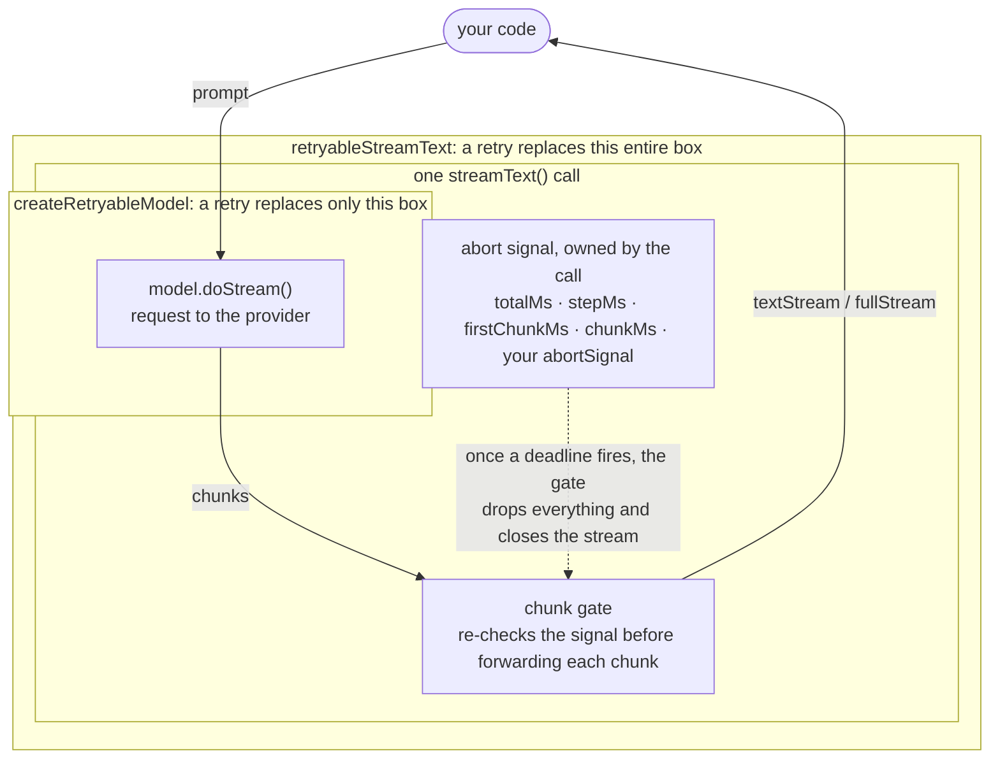
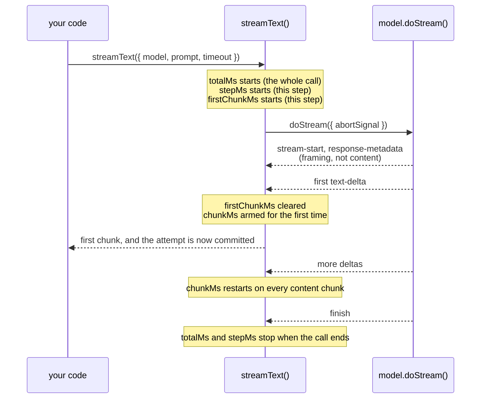

# Timeouts

This document is the deep dive behind the README's [Timeouts](../README.md#timeouts) section: which deadline fires when, which retry layer can recover it, and why. Throughout, "deadline" means one configured timeout window, or the moment it fires.

## Who owns a deadline

A `timeout` you pass to `generateText` or `streamText` belongs to **the call**, not to the model. The SDK merges every `timeout.*` window plus your `abortSignal` into one abort signal and tears the call down when any of them fires.

- `createRetryableModel` wraps the model and retries *underneath* the call, so it cannot undo something the call has already done to itself.
- The call-level functions (`retryableGenerateText`, `retryableStreamText`, …) re-run the whole call, signal included, so a fresh attempt gets a fresh deadline.

A deadline a retry sets *itself* is a different matter: a retry's own `timeout` aborts only that attempt, never the call, so it recovers under both entry points.

## Which deadline fires when

In both tables, "Outcome" is what a **retryable model** can do about that deadline. The call-level functions recover every row (except a genuine caller cancel, which is honored, not retried).

**Under `generateText`**

| Deadline             | Clock                           | Outcome  |
| -------------------- | ------------------------------- | -------- |
| `timeout.totalMs`    | the whole call, from call start | recovers |
| `timeout.stepMs`     | one step, from step start       | recovers |
| caller `abortSignal` | whenever the caller aborts      | recovers |

**Under `streamText`**

| Deadline               | Clock                                                                 | Outcome                    |
| ---------------------- | --------------------------------------------------------------------- | -------------------------- |
| `timeout.totalMs`      | the whole call, from call start                                       | discarded                  |
| `timeout.stepMs`       | one step, from step start                                             | discarded                  |
| `timeout.firstChunkMs` | step start until the first content chunk                              | discarded                  |
| `timeout.chunkMs`      | the gap between content chunks, armed only once the first one arrives | never fires before content |
| caller `abortSignal`   | whenever the caller aborts                                            | discarded                  |

"Discarded" means the fallback is attempted and really does run (`onError` and `onRetry` fire, the fallback model is called), but its output never reaches the consumer. That is a separate thing from the streaming commit boundary, and stricter: it applies even when no content was ever emitted, so a stall before the very first chunk is dropped just the same ([#50](https://github.com/zirkelc/ai-retry/issues/50)).

Three sharp edges in those tables:

- `firstChunkMs` and `chunkMs` are streaming-only, but all four keys share one type, so `generateText` accepts them and then never reads them. A `generateText` call configured with only those keys has no deadline at all, and a stalled model hangs indefinitely.
- `chunkMs` measures the gap *between* content chunks, so its timer is only armed once the first content chunk arrives. It never catches a model that stalls before producing anything, and once it can fire the attempt is already committed.
- Where a table says "recovers", the retry must still supply its own `timeout` whenever the inbound signal has already fired, otherwise `ai-retry` re-throws instead of retrying against a dead signal (see [Retry timeouts at the model layer](#retry-timeouts-at-the-model-layer)).

## Why the call layer recovers what a retryable model cannot

`streamText` runs the call, and your model instance is one piece it uses along the way:

1. Before it touches the model, it builds **one abort signal** out of every `timeout.*` you passed plus any `abortSignal` of your own.
2. It calls `model.doStream()` underneath that signal, once per step.
3. It forwards the model's chunks to you through a **gate** that re-checks the signal before every chunk.



The nesting decides what a retry can recover:

- **`createRetryableModel` swaps the model**, the innermost box. The signal and the gate survive the swap, so the fallback runs and produces chunks, and the gate drops every one of them: the signal it checks latched the moment the deadline fired.
- **`retryableStreamText` swaps the call**, signal and gate included, so the fallback gets fresh ones and its output reaches you.

`generateText` has the same layering minus the gate, which is why a retryable model recovers `generateText` deadlines but not `streamText` ones.

| Layer       | What a retry replaces                     | `generateText` deadlines | `streamText` deadlines |
| ----------- | ----------------------------------------- | ------------------------ | ---------------------- |
| Model layer | `doGenerate` / `doStream`, below the call | recovers                 | cannot recover         |
| Call layer  | the whole call, above the model           | recovers                 | recovers               |

## When each timer runs



Note where the commit point falls: `chunkMs` cannot arm until the first content chunk, and that same chunk is what puts the attempt beyond retry. A timer that only starts after commit can never produce a recoverable failure, at either layer.

## Retry timeouts at the model layer

When a retry specifies a `timeout`, a fresh `AbortSignal.timeout()` is created for that attempt. If the original `abortSignal` is still alive, the fresh deadline is composed with it via `AbortSignal.any()` so user cancellation still works. If the original signal is already aborted (a request-level deadline already fired), it is dropped so the retry runs against the fresh deadline alone.

If the original `abortSignal` is already aborted at the time of retry and the retry does **not** supply a `timeout`, `ai-retry` re-throws the original error rather than firing a misleading retry against the dead signal. `onError` still fires for observability; `onRetry` is skipped. Setting `timeout` is the explicit opt-in for retrying past an aborted signal.

Below a model the deadline can only be a plain number of milliseconds: a retryable model applies its deadline by building an `AbortSignal`, which carries a wall-clock budget and nothing else.

## Retry timeouts at the call layer

`Retry.timeout` gives each attempt a fresh deadline; the first attempt's clock is already spent by the time it fails.

A number is a total budget in milliseconds. An object is the SDK's own timeout configuration, and is **merged** into whatever the call already carried, key by key, so narrowing one window leaves the others standing:

```typescript
const result = await retryableStreamText({
  model: primaryModel,
  prompt: 'Invent a new holiday.',
  timeout: { totalMs: 30_000, firstChunkMs: 5_000 },
  retry: [
    /** This attempt gets firstChunkMs 2s, and keeps totalMs 30s. */
    timeout().switch({ model: fallbackModel, timeout: { firstChunkMs: 2_000 } }),
  ],
});
```

**Which `timeout` shape a retry accepts depends on the entry point it is used with**, because each entry point can only measure some of the windows:

| Retry lands in                        | `timeout` accepts                              |
| ------------------------------------- | ---------------------------------------------- |
| `createRetryableModel`                | `number`                                       |
| `embed`, `embedMany`, `generateImage` | `number \| { totalMs }`                        |
| `generateText`                        | `number \| { totalMs, stepMs, toolMs, tools }` |
| `streamText`                          | the above plus `{ firstChunkMs, chunkMs }`     |

Naming a window the destination cannot measure is a **type error** rather than a deadline that never fires. So `{ chunkMs: 100 }` on a `generateText` retry is rejected, where the SDK's own `timeout` argument would accept it on the same call and then never read it.

**`embed`, `embedMany` and `generateImage` take a `timeout` of their own here**, which the SDK does not give them. It is this library's argument, turned into a fresh `AbortSignal` per attempt and never passed on. Composing a deadline into `abortSignal` yourself would not work: it reads as a cancellation, so it kills the first attempt and every retry with it.

Your own `abortSignal` is never treated as a deadline. If it aborts, the call is cancelled and no fail-over is attempted; a genuine cancel is not a failure to recover from.
